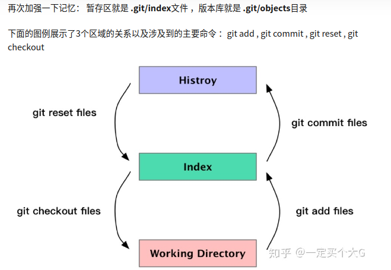
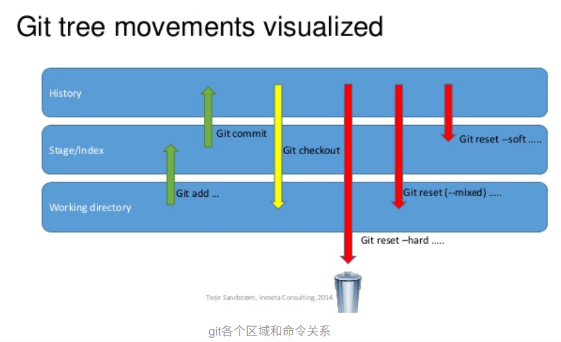
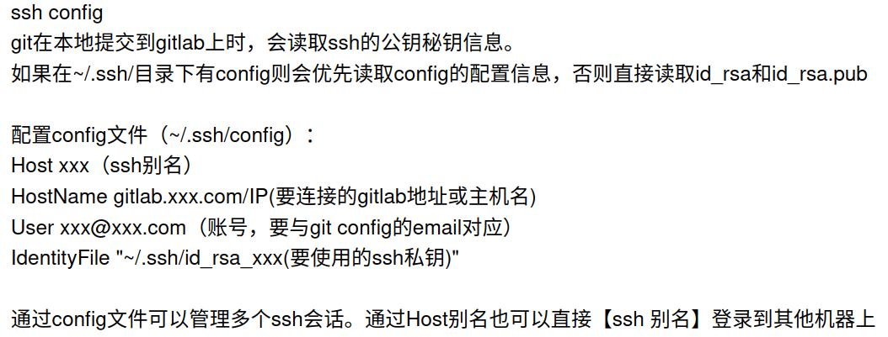
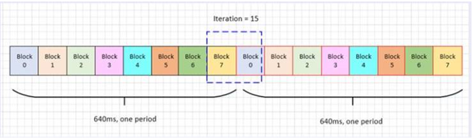
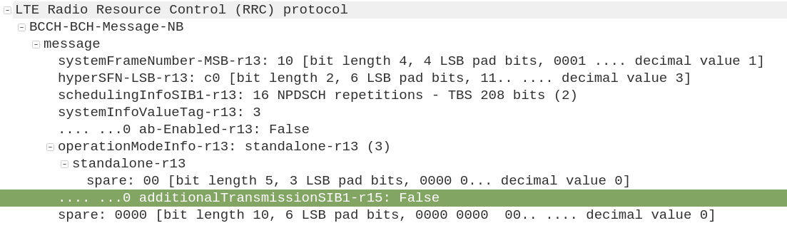
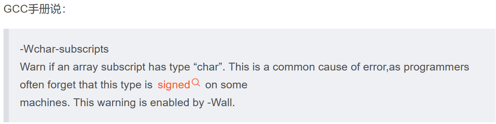
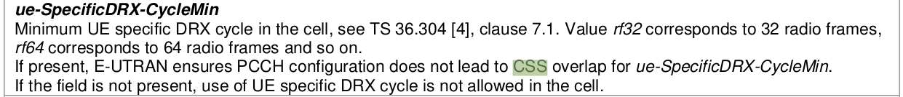
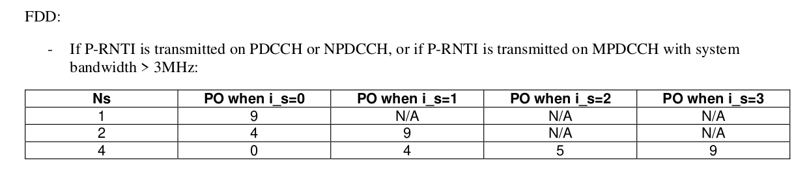
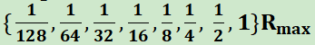

### 20211217
*   修改脚本rrc_diag.sh来parsing出branch_v31的serving cell distribution (for上海CT)
*   Tidy up关于PAPR vs RSSI的邮件，整理出actions，和owen讨论
*   gain change -84，需要等下周Ted看完
*   merge master的改动到branch 3.1 (关于收SI之前预留tracking cell search的时间)

### 20211218
*   [Git原理及使用](https://zhuanlan.zhihu.com/p/66506485)

*   [Git中rebase 和 merge 的正确使用姿势](https://zhuanlan.zhihu.com/p/93635269)
*   [Git Reset三种模式](https://www.jianshu.com/p/c2ec5f06cf1a)

*   [git ssh免登陆，以及ssh config](https://www.cnblogs.com/meitian/p/6776129.html)


### 20211220
*   上海QC test，CT cell分析，15/17的概率，同一个cell，MIB解不好
*   请假半天
*   帮忙刘璐看POWER_PROFILING_LOG的问题
*   请教JY关于SD-RDP的事情，是远程桌面使用vscode的

### 20211221
*   MIB的combine次数调整成128，去看BB实际会用到的次数，lockf到(2506, 271)
    > 从之前的结果来看，BB有效的合并次数在某些条件下没有被满足，不同周期里mib的sub-block不会被soft combine

    > 看起来lock过去后，SI都解不下来，attach做不成功
*   试用owen提供的jenkins job去trigger北京QC
    > 卡住在download image，130的jenkins那边的credentials改成了开机(签核)密码，待确认

### 20211222
*   新增苏州两台PC和深圳PC的jenkins client
    > 有请IT帮忙开通实验室可以访问130的jenkins网页
*   lockf到(2506, 271)，比对试验：combine次数加到最大为128 vs 保持原有mainline的combine次数不变的数据整理


### 202111223
*   针对苏州multi board，create多个user，并enable多个jenkins-slave.service，可以work，
    > 但JY的提议是不需要多个user，而是用container来区分，也能解决同一台电脑的tshark用不同的database去parse talog的问题
*   Ted组织meeting，关于MIB pass rate只有85%的问题
    > 1.看起来CS看到的strongest cell(NSSS)和common path看到的SNR最好的cell(NRS)存在mismatch的地方
    > 2.需要再做对比试验：解MIB时对准640ms的frame boundary，只要成功解下来一次MIB，就可以知道serving cell的system frame讯息

### 20211224
*   生成patch做对比实验
    > 1.在align serving cell时候，suspend MSG task，然后做300次MIB，对齐640ms的frame boundary
    > 2.上述1.在苏州可以work，但是在上海不能work，因为没办法前进到收到SIB2这一步，所以只能在MIB pass后，suspend MSG task
    > 3.上述2.在苏州可以work，最多可以前进到240次MIB做完，但上海lock过去cell的MIB pass rate很低，不确定是天线位置有变还是说tracking做的太少，还是说跟醒睡有关(sleepmode为2)，从结果来看，前10次还都是CRC pass，后面就CRC fail占70%，预计周一要调整一下变因看看，或换一个cell看看
*   和owen提QC需求，请他新增临时可以控制某台PC跑QC的功能，而不是一旦trigger，所有的PC都会一起run；以及trigger QC时，可以自己下config
    > 问题1：130上trigger qc，是省去了ftp那一路，那么image从何而来？还是说不需要image，直接就跑case？
    > A：给出RELEASE_NAME为CN3WD7_COOPER-Test-1783-2021_1228_1056格式的folder，会自动去该folder里面去捞image(ftp)，USER_NAME填自己的account

### 20211227
*   生成patch做对比实验
    > 上海lock过去cell的MIB pass rate很低，不确定是天线位置有变还是说tracking做的太少，还是说跟醒睡有关(sleepmode为2)，从结果来看，前10次还都是CRC pass，后面就CRC fail占70%，预计周一要调整一下变因看看，或换一个cell看看
    > 1.由于timing没重找，mib解出来一次后，一直做300次，就很有可能後面一旦出問題就沒救了，變成不是indenpendent trial
    > 2.由于没有align serving cell，没有补进analog，所以一直靠digital
    > 3.换苏州的cell，(2509, 143)，对不对齐640ms，没有特别明显的差异，因为現在是camp on一個訊號好的cell，所以很快就能解下來，不對齊的case其實有可能也都是沒有跨過640ms的
    > 4.强制不对齐640ms，比如630ms处去收MIB，苏州再换cell(2509, 269)，对齐和不对齐640ms结果也是有好有差

### 20211228
*   生成patch做对比实验
    > 1.强制不对齐640ms，比如570ms处去收MIB，苏州lock到cell(2509, 269)，对齐和不对齐640ms结果依旧是有好有差
    > 2.切换到callbox上，SNR配置成-13dB，combine count的差别在63-57+1=7附近，对齐的combine count为27.5，不对齐(570ms)的是33.5，和BB的说法相符
    > 3.目前将combine count调整为原先的2倍即可
*   branch v2.0收SI时计算duration有问题，RRC stop SI req后，需要将GetSiBitMap设为0
*   在SDN里make cdex时，需要先clean掉，不然不会被update
*   帮owen commit：rrc diag update for extending coreid to support different branch
*   协助harris并发实验

### 20211229
*   Reduced system acquisition time

### 20211230
*   Reduced system acquisition time
    > 1.和casey讨论SIB1的子帧3和子帧4如何combine的问题
    > 2.API: l1cPhyNpdschInit以及函数npdschInitializationRTK
    ```sh
    if (infoType!=2)
        pL1NpdschRxData->localRep = 1; // 这边注意后面要改成Nrep
    else
        pL1NpdschRxData->localRep = (Nrep > 4) ? 4 : Nrep;
    ```

### 20211231
*   Reduced system acquisition time
    > 1.把additionalTransmissionSib1放在L1C_SIB1_SCHEDULING这个struct里，由于解background SIB1的时候，background MIB不会送给上层，所以拿不到additionalTransmissionSIB1，只能从raw data取得
    > 2.解到MIB后的(npbchDecodeResult.npbch[2] & 0x01)就是
    .... ...0 additionalTransmissionSIB1-r15: False
    
    > 3.更新programTime和l1cSetRxPreprocessConfig的时间

### 20220104
*   Fix the compile warning about MIB/SIB1/SI
    > 1. 防止使用负的数组下标，[解决 array subscript has type char 错误](https://blog.csdn.net/sjygqz/article/details/106583420)
    
*   Commit the code (Reduced system acquisition time) to the master with the macro <font color='red'> ENABLE_R15_ADDITIONAL_TRANS_SIB1 </font>

### 20220105
*   Improved latency - UE specific DRX
*   听ethan_xu汇报关于dump NPSS IQ的相关内容

### 20220106
*   Improved latency - UE specific DRX
    > 和casey讨论关于CSS overlap的含义，应该是表示当ue-SpecificDRX-CycleMin被使用时，PCCH configuration中的npdcch-NumRepetitionPaging-r13不能太大，导致search space overlap的情况
    
*   zoey_yang汇报关于R15 feature的相关内容

### 20220107
*   Presence of NRS on a non-anchor carrier for paging
    > 和casey讨论关于NRS的的位置是在PO前的第10th个DL subframe开始
    >> * 原因1：不同UE PO group(当Ns=4时，PO=0，4，5)里面PO前的DL subframe上的NRS可以被某个UE(当Ns=4时，该UE的PO=9)使用
    >> 
    >> * 原因2：为了满足NRSRP measurement，有做过SNR accuracy的simulation，PO前和PO后的DL subframe个数加起来要为8~10个
*   查找CR ***R2-1818628***：关于 ***additionalTxSIB1-Config*** 和DL subframe的关系，更新PPT，有待讨论
*   回顾zoey_yang的document：Code Review of EDT

### 20220110
*   和emma/casey讨论关于SIB1的combine次数是否有需要enlarge为2倍
    > 对比MIB的combine次数之前有enlarge为2倍的情况，BB在combine时，不同640ms的data不会拿来combine，原因是两个不同640ms的mib信息是不同的，编码后整个mib就是不同的，combine时合并的是软信息(表示为0或1的可能性大小)，如果原始的0/1数据并不相同，没法简单地直接把软信息相加
    > 对于解SIB1的时候，由于已知MIB里的系统帧信息+低2位的hyper帧信息，所以SIB1这边在enlarge combine次数时，一旦发现初始计算的combine次数跨过了2个hyper boundary，就需要调整
*   L1C bi-weekly周会

### 20220111
*   和casey讨论并且commit code：关于有条件地调整SIB1的combine次数
*   关于 ***additionalTxSIB1-Config*** 和DL subframe的关系，和casey确认理解：除非additionalTxSIB1-Config配成true，否则UE不应该在不包含SIB1的子帧3上monitor下行相关的NPDCCH/NPDSCH
    > ***<font color='red'> 36.213 16.4 Narrowband physical downlink shared channel related procedures </font>***
    except when the UE is configured with higher layer parameter additionalTxSIB1-Config set to TRUE, subframe #3 not containing additional SystemInformationBlockType1-NB transmission is assumed as a NB-IoT DL subframe if the UE monitors a NPDCCH UE-specific search space or decodes NPDSCH transmission scheduled by NPDCCH in the UE-specific search space.
    > 
    > ***R2-1818628***
    However, the scenario of initial connection establishment hasn’t been covered by the current specifications. For a R15 UE that supports additional SIB1, the UE would always assume there exists dedicated transmission for it in subframe #3 not containing additional SIB1 after reception of Msg4. But for eNB, after transmission of Msg4 and before end of UE capability acquisition, the eNB would not schedule dedicated transmission on the subframe #3. The UE may incorrectly monitor NPDCCH and decode NPDSCH transmission, and finally failure to receive the downlink messages. Then for example, the UE capability acquisition procedure or RRC reconfiguration procedure may fail.
    > 
    > Therefore, the UE that supports additional SIB1 cannot assume by default the subframe #3 not containing additional SIB1 transmission as valid DL subframe. An explicit indication to UE would be needed. The UE can assume the subframe #3 not containing additional SIB1 transmission as valid DL subframe only after it obtains the indication from the eNB. For the eNB, it can set such indication for indicating subframe #3 as valid DL subframe in RRC message, e.g, Msg4 only after it acquires the UE capability.
*   Release RAM space for R15 meeting by Ted

### 20220112
*   Review the code about VPHY R15
*   Study the spec 36.211/36.212/36.213 of R15
*   Build image for [NBIOTCOPER-2809](NBIOTCOPER-2809)
    > build cooper时，需要先执行./clean.sh，否则会报错
    > 再执行MODEM_DIR=/SDLC/usr/RSDOMAIN/manda_tang/code/modem ./build_cooper_tracker_pet.sh
### 20220113
*   Study the test cases in 36.523-1
*   安装Docker in Beijing/Shenzhen PC
    ```
    sudo apt install docker.io
    sudo usermod -a -G docker jenkins
    sudo sh -c 'echo "{ \"insecure-registries\": [\"172.26.5.129\"] }" > /etc/docker/daemon.json'
    sudo systemctl restart docker
    ```
*   WUS(wake-up signal)相关meeting调查
    > ***RAN WG1 #92bis：Final_Minutes_report_RAN1#92b_v100***
*   sudo systemctl <font color='red'>start</font> jenkins-slave.service
    > 需要将agent.jar的user改为：/home/jenkins$ sudo chown <font color='red'>jenkins:jenkins agent.jar</font>
    > 
    > 在sudo systemctl <font color='red'>enable</font> jenkins-slave.service之后，手动执行start service的动作或者restart PC
*   协助casey在SDN内安装vscode-cpptools，版本需为1.8.0-insiders2
    > [vscode-cpptools 1.8.0-insiders2](https://github.com/microsoft/vscode-cpptools/releases/tag/1.8.0-insiders2)
*   checkout branch ***phy_save_ram***，后续需要将MIB/SIB1/SI的code搬到Flash

### 20220114
*   将MIB/SIB1/SI/Drx/Resource manage的code搬到Flash
*   WUS(wake-up signal)相关meeting调查
    > ***R1-1803867 On configurations and procedures of power saving signal Huawei, HiSilicon***
    > Proposal 3: The list of values of configured maximum duration of WUS is  valid subframes.
    > And we also propose that the configured maximum duration of WUS is defined in the number of valid subframes, which is similar with the definition of Rmax.
    > 
    > ***RAN WG1 #92bis：Final_Minutes_report_RAN1#92b_v100***
    >> Agreement
    > WUS is postponed in subframes that are not NB-IoT DL subframes and is not transmitted [FFS dropped/postponed] in the subframes that carries SIs other than SIB1.
    >>> Note: “Postpone” means the corresponding subframes are not counted as configured maximum WUS transmission duration and actual WUS transmission duration.
    >>> Note: This does not imply that the minimum gap between the end of actual WUS duration and the first associated PO is reduced

### 20220117
*   协助ethan_xu cherry-pick from master to branch 3.1
    > git commit --amend的使用
*   revert掉：Drx/Resource manage的code搬到Flash
    > connected下会用到的函数暂时不适合搬到flash
*   profile MIB/SIB1/SI模块中各个state用到的cycle count (for master)
*   EDT/Format2 参数handle