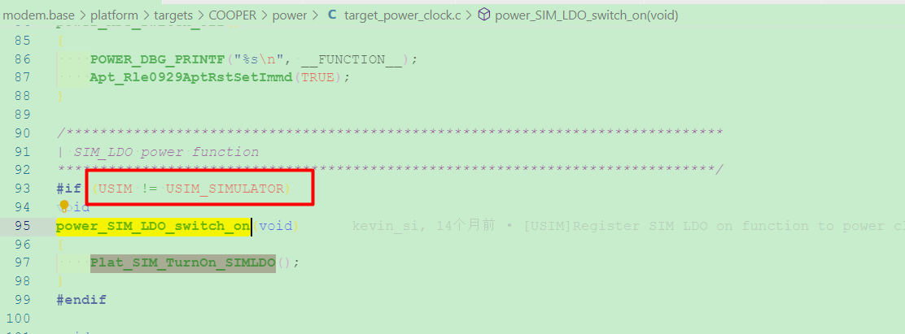

### 20211217
*   修改脚本rrc_diag.sh来parsing出branch_v31的serving cell distribution (for上海CT)
*   Tidy up关于PAPR vs RSSI的邮件，整理出actions，和owen讨论
*   gain change -84，需要等下周Ted看完
*   merge master的改动到branch 3.1 (关于收SI之前预留tracking cell search的时间)

### 20211218
*   [Git原理及使用](https://zhuanlan.zhihu.com/p/66506485)

*   [Git中rebase 和 merge 的正确使用姿势](https://zhuanlan.zhihu.com/p/93635269)
*   [Git Reset三种模式](https://www.jianshu.com/p/c2ec5f06cf1a)

*   [git ssh免登陆，以及ssh config](https://www.cnblogs.com/meitian/p/6776129.html)


### 20211220
*   上海QC test，CT cell分析，15/17的概率，同一个cell，MIB解不好
*   请假半天
*   帮忙刘璐看POWER_PROFILING_LOG的问题
*   请教JY关于SD-RDP的事情，是远程桌面使用vscode的

### 20211221
*   MIB的combine次数调整成128，去看BB实际会用到的次数，lockf到(2506, 271)
    > 从之前的结果来看，BB有效的合并次数在某些条件下没有被满足，不同周期里mib的sub-block不会被soft combine

    > 看起来lock过去后，SI都解不下来，attach做不成功
*   试用owen提供的jenkins job去trigger北京QC
    > 卡住在download image，130的jenkins那边的credentials改成了开机(签核)密码，待确认

### 20211222
*   新增苏州两台PC和深圳PC的jenkins client
    > 有请IT帮忙开通实验室可以访问130的jenkins网页
*   lockf到(2506, 271)，比对试验：combine次数加到最大为128 vs 保持原有mainline的combine次数不变的数据整理


### 202111223
*   针对苏州multi board，create多个user，并enable多个jenkins-slave.service，可以work，
    > 但JY的提议是不需要多个user，而是用container来区分，也能解决同一台电脑的tshark用不同的database去parse talog的问题
*   Ted组织meeting，关于MIB pass rate只有85%的问题
    > 1.看起来CS看到的strongest cell(NSSS)和common path看到的SNR最好的cell(NRS)存在mismatch的地方
    > 2.需要再做对比试验：解MIB时对准640ms的frame boundary，只要成功解下来一次MIB，就可以知道serving cell的system frame讯息

### 20211224
*   生成patch做对比实验
    > 1.在align serving cell时候，suspend MSG task，然后做300次MIB，对齐640ms的frame boundary
    > 2.上述1.在苏州可以work，但是在上海不能work，因为没办法前进到收到SIB2这一步，所以只能在MIB pass后，suspend MSG task
    > 3.上述2.在苏州可以work，最多可以前进到240次MIB做完，但上海lock过去cell的MIB pass rate很低，不确定是天线位置有变还是说tracking做的太少，还是说跟醒睡有关(sleepmode为2)，从结果来看，前10次还都是CRC pass，后面就CRC fail占70%，预计周一要调整一下变因看看，或换一个cell看看
*   和owen提QC需求，请他新增临时可以控制某台PC跑QC的功能，而不是一旦trigger，所有的PC都会一起run；以及trigger QC时，可以自己下config
    > 问题1：130上trigger qc，是省去了ftp那一路，那么image从何而来？还是说不需要image，直接就跑case？
    > A：给出RELEASE_NAME为CN3WD7_COOPER-Test-1783-2021_1228_1056格式的folder，会自动去该folder里面去捞image(ftp)，USER_NAME填自己的account

### 20211227
*   生成patch做对比实验
    > 上海lock过去cell的MIB pass rate很低，不确定是天线位置有变还是说tracking做的太少，还是说跟醒睡有关(sleepmode为2)，从结果来看，前10次还都是CRC pass，后面就CRC fail占70%，预计周一要调整一下变因看看，或换一个cell看看
    > 1.由于timing没重找，mib解出来一次后，一直做300次，就很有可能後面一旦出問題就沒救了，變成不是indenpendent trial
    > 2.由于没有align serving cell，没有补进analog，所以一直靠digital
    > 3.换苏州的cell，(2509, 143)，对不对齐640ms，没有特别明显的差异，因为現在是camp on一個訊號好的cell，所以很快就能解下來，不對齊的case其實有可能也都是沒有跨過640ms的
    > 4.强制不对齐640ms，比如630ms处去收MIB，苏州再换cell(2509, 269)，对齐和不对齐640ms结果也是有好有差

### 20211228
*   生成patch做对比实验
    > 1.强制不对齐640ms，比如570ms处去收MIB，苏州lock到cell(2509, 269)，对齐和不对齐640ms结果依旧是有好有差
    > 2.切换到callbox上，SNR配置成-13dB，combine count的差别在63-57+1=7附近，对齐的combine count为27.5，不对齐(570ms)的是33.5，和BB的说法相符
    > 3.目前将combine count调整为原先的2倍即可
*   branch v2.0收SI时计算duration有问题，RRC stop SI req后，需要将GetSiBitMap设为0
*   在SDN里make cdex时，需要先clean掉，不然不会被update
*   帮owen commit：rrc diag update for extending coreid to support different branch
*   协助harris并发实验

### 20211229
*   Reduced system acquisition time

### 20211230
*   Reduced system acquisition time
    > 1.和casey讨论SIB1的子帧3和子帧4如何combine的问题
    > 2.API: l1cPhyNpdschInit以及函数npdschInitializationRTK
    ```sh
    if (infoType!=2)
        pL1NpdschRxData->localRep = 1; // 这边注意后面要改成Nrep
    else
        pL1NpdschRxData->localRep = (Nrep > 4) ? 4 : Nrep;
    ```

### 20211231
*   Reduced system acquisition time
    > 1.把additionalTransmissionSib1放在L1C_SIB1_SCHEDULING这个struct里，由于解background SIB1的时候，background MIB不会送给上层，所以拿不到additionalTransmissionSIB1，只能从raw data取得
    > 2.解到MIB后的(npbchDecodeResult.npbch[2] & 0x01)就是
    .... ...0 additionalTransmissionSIB1-r15: False
    
    > 3.更新programTime和l1cSetRxPreprocessConfig的时间

### 20220104
*   Fix the compile warning about MIB/SIB1/SI
    > 1. 防止使用负的数组下标，[解决 array subscript has type char 错误](https://blog.csdn.net/sjygqz/article/details/106583420)
    
*   Commit the code (Reduced system acquisition time) to the master with the macro <font color='red'> ENABLE_R15_ADDITIONAL_TRANS_SIB1 </font>

### 20220105
*   Improved latency - UE specific DRX
*   听ethan_xu汇报关于dump NPSS IQ的相关内容

### 20220106
*   Improved latency - UE specific DRX
    > 和casey讨论关于CSS overlap的含义，应该是表示当ue-SpecificDRX-CycleMin被使用时，PCCH configuration中的npdcch-NumRepetitionPaging-r13不能太大，导致search space overlap的情况
    
*   zoey_yang汇报关于R15 feature的相关内容

### 20220107
*   Presence of NRS on a non-anchor carrier for paging
    > ***R1-1903914 NRS presence on non-anchor carriers for paging Huawei, HiSilicon***
    > 和casey讨论关于NRS的的位置是在PO前的第10th个DL subframe开始
    >> * 原因1：不同UE PO group(当Ns=4时，PO=0，4，5)里面PO前的DL subframe上的NRS可以被某个UE(当Ns=4时，该UE的PO=9)使用
    >> 
    >> * 原因2：为了满足NRSRP measurement，有做过SNR accuracy的simulation，PO前和PO后的DL subframe个数加起来要为8~10个
    >
    > ***R1-1903896 Presence of NRS on a non-anchor carrier for paging in NB-IoT Ericsson***
*   查找CR ***R2-1818628***：关于 ***additionalTxSIB1-Config*** 和DL subframe的关系，更新PPT，有待讨论
*   回顾zoey_yang的document：Code Review of EDT

### 20220110
*   和emma/casey讨论关于SIB1的combine次数是否有需要enlarge为2倍
    > 对比MIB的combine次数之前有enlarge为2倍的情况，BB在combine时，不同640ms的data不会拿来combine，原因是两个不同640ms的mib信息是不同的，编码后整个mib就是不同的，combine时合并的是软信息(表示为0或1的可能性大小)，如果原始的0/1数据并不相同，没法简单地直接把软信息相加
    > 对于解SIB1的时候，由于已知MIB里的系统帧信息+低2位的hyper帧信息，所以SIB1这边在enlarge combine次数时，一旦发现初始计算的combine次数跨过了2个hyper boundary，就需要调整
*   L1C bi-weekly周会

### 20220111
*   和casey讨论并且commit code：关于有条件地调整SIB1的combine次数
*   关于 ***additionalTxSIB1-Config*** 和DL subframe的关系，和casey确认理解：除非additionalTxSIB1-Config配成true，否则UE不应该在不包含SIB1的子帧3上monitor下行相关的NPDCCH/NPDSCH
    > ***<font color='red'> 36.213 16.4 Narrowband physical downlink shared channel related procedures </font>***
    except when the UE is configured with higher layer parameter additionalTxSIB1-Config set to TRUE, subframe #3 not containing additional SystemInformationBlockType1-NB transmission is assumed as a NB-IoT DL subframe if the UE monitors a NPDCCH UE-specific search space or decodes NPDSCH transmission scheduled by NPDCCH in the UE-specific search space.
    > 
    > ***R2-1818628***
    However, the scenario of initial connection establishment hasn’t been covered by the current specifications. For a R15 UE that supports additional SIB1, the UE would always assume there exists dedicated transmission for it in subframe #3 not containing additional SIB1 after reception of Msg4. But for eNB, after transmission of Msg4 and before end of UE capability acquisition, the eNB would not schedule dedicated transmission on the subframe #3. The UE may incorrectly monitor NPDCCH and decode NPDSCH transmission, and finally failure to receive the downlink messages. Then for example, the UE capability acquisition procedure or RRC reconfiguration procedure may fail.
    > 
    > Therefore, the UE that supports additional SIB1 cannot assume by default the subframe #3 not containing additional SIB1 transmission as valid DL subframe. An explicit indication to UE would be needed. The UE can assume the subframe #3 not containing additional SIB1 transmission as valid DL subframe only after it obtains the indication from the eNB. For the eNB, it can set such indication for indicating subframe #3 as valid DL subframe in RRC message, e.g, Msg4 only after it acquires the UE capability.
*   Release RAM space for R15 meeting by Ted

### 20220112
*   Review the code about VPHY R15
*   Study the spec 36.211/36.212/36.213 of R15
*   Build image for [NBIOTCOPER-2809](NBIOTCOPER-2809)
    > build cooper时，需要先执行./clean.sh，否则会报错
    > 再执行MODEM_DIR=/SDLC/usr/RSDOMAIN/manda_tang/code/modem ./build_cooper_tracker_pet.sh
### 20220113
*   Study the test cases in 36.523-1
*   安装Docker in Beijing/Shenzhen PC
    ```sh
    sudo apt install docker.io
    sudo usermod -a -G docker jenkins
    sudo sh -c 'echo "{ \"insecure-registries\": [\"172.26.5.129\"] }" > /etc/docker/daemon.json'
    sudo systemctl restart docker
    ```
*   WUS(wake-up signal)相关meeting调查
    > ***RAN WG1 #92bis：Final_Minutes_report_RAN1#92b_v100***
*   sudo systemctl <font color='red'>start</font> jenkins-slave.service
    > 需要将agent.jar的user改为：/home/jenkins$ sudo chown <font color='red'>jenkins:jenkins agent.jar</font>
    > 
    > 在sudo systemctl <font color='red'>enable</font> jenkins-slave.service之后，手动执行start service的动作或者restart PC
*   协助casey在SDN内安装vscode-cpptools，版本需为1.8.0-insiders2
    > [vscode-cpptools 1.8.0-insiders2](https://github.com/microsoft/vscode-cpptools/releases/tag/1.8.0-insiders2)
*   checkout branch ***phy_save_ram***，后续需要将MIB/SIB1/SI的code搬到Flash

### 20220114
*   将MIB/SIB1/SI/Drx/Resource manage的code搬到Flash
*   WUS(wake-up signal)相关meeting调查
    > ***R1-1803867 On configurations and procedures of power saving signal Huawei, HiSilicon***
    > Proposal 3: The list of values of configured maximum duration of WUS is  valid subframes.
    > And we also propose that the configured maximum duration of WUS is defined in the number of valid subframes, which is similar with the definition of Rmax.
    > 
    > ***RAN WG1 #92bis：Final_Minutes_report_RAN1#92b_v100***
    >> Agreement
    > WUS is postponed in subframes that are not NB-IoT DL subframes and is not transmitted [FFS dropped/postponed] in the subframes that carries SIs other than SIB1.
    >>> Note: “Postpone” means the corresponding subframes are not counted as configured maximum WUS transmission duration and actual WUS transmission duration.
    >>> Note: This does not imply that the minimum gap between the end of actual WUS duration and the first associated PO is reduced

### 20220117
*   协助ethan_xu cherry-pick from master to branch 3.1
    > git commit --amend的使用
*   revert掉：Drx/Resource manage的code搬到Flash
    > connected下会用到的函数暂时不适合搬到flash
*   profile MIB/SIB1/SI模块中各个state用到的cycle count (for master)
*   EDT/Format2 参数handle

### 20220118
*   RS-PC-3、RS-PC-4的jenkins-slave service的secret key设置错误，导致断连
*   配置VS-code的remote-ssh不用输入密码
    > 1.在10.22.13.104中输入ssh-keygen
    > 2.将生成的id_rsa-remote-ssh.pub copy到10.22.13.24中的~/.ssh/
    > 3.打开VScode配置SSH config，在最后一行添加IdentityFile，(每台Host底下都要写)
    >>```sh
    >>IdentityFile ~/.ssh/id_rsa-remote-ssh
    >>```
    > 4.在10.22.13.25中执行：
    >>```sh
    >>cat id_rsa-remote-ssh.pub >> authorized_keys
    >>```
*   profile MIB/SIB1/SI模块中各个state用到的cycle count (for master vs branch phy_save_ram)

*   EDT/Format2 参数handle (60%)
*   jira记录：使用at command去控制release version [NBIOTCOPER-2816](https://jira.realtek.com/browse/NBIOTCOPER-2816)

### 20220119
*   [NBIOTCOPER-447](https://jira.realtek.com/browse/NBIOTCOPER-447)
    > 有看到702640 MSG_ID_LTE_PHYARRC_DIRECT_IND_INFO_IND
*   narrow down [NBIOTCOPER-2817](https://jira.realtek.com/browse/NBIOTCOPER-2817)
*   36.304 V16.5.0 Chapter 7.6
### 20220120
*   36.304 V16.5.0 Chapter 7.5.1、7.5.2
*   学习wip的用法，git commit中需要带上
    >```sh
    >%ap_config=PET_TRACKER=1%
    >```
### 20220121
*   36.304 V16.5.0 Chapter 7.5.3、7.5.4
*   Group Wake up signal meeting调查
    > ***Final_Minutes_report_RAN1#90b_v100***
    > R1-1718141 Wake-up signal configurations and procedures Qualcomm Incorporated
    > R1-1719471 On configurations and procedures of power saving signal Huawei, HiSilicon
*   Sync with casey about nprach parameters in SIB22-NB and SIB23-NB

### 20220124
*   [NBIOTCOPER-2824](https://jira.realtek.com/browse/NBIOTCOPER-2824)
*   narrow down [NBIOTCOPER-2822](https://jira.realtek.com/browse/NBIOTCOPER-2822)
*   协助harris使用SDN
*   L1C bi-weekly meeting

### 20220125
*   [NBIOTCOPER-2825](https://jira.realtek.com/browse/NBIOTCOPER-2825)
*   EDT feature in spec 36.321 V15.11.0

### 20220126
*   36.523-1 V16.11.0 GCF case study
*   sync with lizzie about EDT/Fmt2 parameter
*   SIB1 decode fail in Taipei Dazhi office
*   学习assert/fail log dump from flash
*   review the difference of l1c_npbch.c between branch v2.0 and master
*   跟JY了解wireshark plugins(for windows platform)

### 20220127
*   [NBIOTCOPER-2827](https://jira.realtek.com/browse/NBIOTCOPER-2827)
    > 持续观察台北大直办公室是否还有该现象，该cell operation mode为guardband
*   查找资料：关于在子帧3(在特定配置下：repetition为16时)上传输SIB1的原因
    > ***R1-1712629,Reduced system acquisition time for NB-IoT, Ericsson***
    > Among the three NB-IoT deployment modes, the in-band deployment requires longer system acquisition time due to lower transmit power level and puncturing that may occur on NPSS and NSSS resources. Additionally, compared to the standalone and guard-band modes, NPDSCH subframes in the in-band mode have fewer available resource elements due to resources taken by LTE CRS or reserved for LTE downlink control region. This results in a higher coding rate and thus a lower coding gain and reduced reception performance of SIB1-NB and SI messages. Thus, improvement for system acquisition time reduction should primarily target the in-band mode. The solutions that can reduce the system acquisition time for the in-band mode can be directly applied to the guard-band and standalone modes as well.
    >
    > ***R1-1705188, “On system acquisition time reduction,” RAN1#88b, source Ericsson, 3 – 7 April, 2017.***
    > SIB1-NB acquisition performance can be significantly improved by combining across multiple SIB1-NB transmission periods within a SIB1-NB modification period and cross-subframe channel estimation.
    > 
    > ***R1-1712629,Reduced system acquisition time for NB-IoT, Ericsson***
    > On a Rel-13 NB-IoT anchor carrier, the percentage of resource elements available for NPDCCH/NPDSCH symbols, excluding those carrying SIB1-NB, is only 42% in the worst-case scenario (in-band, 3 OFDM symbols for LTE PDCCH, and 4 CRS ports). Using more NPBCH repetitions will further reduce the percentage of resource elements available for NPDCCH/NPDSCH.
    > Using more NPBCH subframes is not considered in Rel-15.
    > 
    > ***R1-1717278 System information acquisition latency enhancement	LG Electronics***
    > 
    > 
*   build target for POSIX platform

### 20220128
*   查找资料：关于在子帧3(在特定配置下：repetition为16时)上传输SIB1的原因
    > ***R1-1801445 Reduction of NB-IoT system information acquisition time Huawei, HiSilicon***
    >> * Alt.1 (same as legacy) [ Please note that the content in the brackets are added for the purpose of explicit reference in the following sections.]: the additional SIB1-NB uses the same coded bits-to-subframes mapping as the legacy SIB1-NB
    >> * Alt.2 (circularly shift): reuse coded bits generated for existing SIB1-NB transmission while coded bits-to-subframe allocation is circularly shifted as much as 8 radio frames compared to the existing SIB1-NB transmission
    >> * Alt.3 (continuing reading): the coded bits that are mapped to subframe #3 used for additional SIB1-NB transmissions are generated by continuing reading from the virtual circular buffer
    > 
    > ***Final_Minutes_report_RAN1#92_v100***
    > 

### 20220208
*   询问JY关于git reset (或rebase)把local branches重新對齊remote branches on SDLC-Gerrit
*   和王凤翔sync关于continue reading from the virtual circular buffer的含义
*   narrow down jira issue [NBIOTCOPER-2828](https://jira.realtek.com/browse/NBIOTCOPER-2828)

### 20220209
*   准备Additional Transmission SIB1的PPT(70%)
*   查找资料关于repetition number为4 or 8时，不采用additional transmission sib1的原因
    > 暂时没翻到曾经看过的：NW不预期认为UE是处于weak coverage，如果repetition number配置为4 or 8的话；并且在同样增加了system overhead的情况下，UE获得的benefit没有repetition number为16时那么大。

### 20220210
*   准备Additional Transmission SIB1的PPT (100%)
*   和勇哥sync关于PPT中Alt1./Alt2./Alt3.的performance问题
*   从R13到R16的5G物联网之路：Chapter 5

### 20220211
*   从R13到R16的5G物联网之路：Chapter 5
    > EDT feature (60%)

### 20220214
*   L1C bi-weekly周会
*   安装Pulse Secure
*   配置Teams on windows 11
    > 解决error:caa70007，[禁用代理服务器](https://www.biaopan8.com/8722.html)

### 20220215
*   Spec R16 36.304：Presence of NRS on a non-anchor carrier for paging
    > 理解The POs with associated NRS的物理意义 (40%)

### 20220216
*   查看相关R1-xxxxxxx proposal：Presence of NRS on a non-anchor carrier for paging
*   试用wireshark-rtk-ra-static
    > 1.旧的wireshark-rtk-ra需要purge 以及 ta.so和ta-dump.so需要删除
    > 2.Mint下打开wireshark闪退问题的解决办法：libcdex upgrade到1.3，JY有将llvm symbols隐藏起来
*   从R13到R16的5G物联网之路：Chapter 6
    > 理解The POs with associated NRS的物理意义 (70%)
    > 粗读Group Wake up Signal的物理意义 (40%)

### 20220217
*   read wireshark.md
*   和Dennis大概讨论enable_cooper_phy_lib在build cdex.database时的问题
    > 由于之后都会采用wireshark-rtk-ra-static，所以只需要.xml文件就可以解析log，这点跟logAssist2一样，而enable_cooper_phy_lib并没有free-struct.xml，所以需要修改makefile文件
    > 之前是cdex/client中通过.h同时生成.cpp和.xml，再拿到cdex/wireshark去生成.so
*   和Emma/Casey讨论有关收取SI的过程中上报out of sync的问题 (当UE处于静止时)
    > 1-a.reference SNR的设定问题，基于该reference SNR加上SNR的variance可以得到低于某个SNR，即可认为解不下来SI
    > 1-b.判定低于某个SNR的占比超过ratio的时间：每次repetition结束 or SI window结束 or tune
    > 2-a.需要BB提供 SNR variance for low SNR in ETU-5
    > 2-b.需要BB提供 ratio? (align to out-of-sync ratio?)

### 20220218
*   和Emma/Casey讨论有关收取SI的过程中上报out of sync的问题 (当UE处于静止时)
    > 确认BB提供的simulation仿真图的理解，是通过横轴看or纵轴看，当SNR = -15dB时，落入-12dB以下的概率为95%，落入-15dB以下的概率为50%，落入-18dB以下的概率为5%
    
*   和Casey讨论有关于EDT feature的物理意义 (70%)

### 20220221
*   从R13到R16的5G物联网之路：Chapter 6
    > 粗读Group Wake up Signal的物理意义 (80%)
*   需要确认RRC那边给定的BC timer(for SI)是否可以cover到4s的时间长度
    > periodicity = 640ms， window length = 480ms，repetition pattern = 2RF，cntPerWindow = 24，max combine count = 128，可以求得timer长度为(128 / 24 + 1) * 640 = 3840ms < 4000ms = 4s
    > ```sh
    > BC_UpdateSIWaitTimer()
    > u8 cntPerWindow = u16SiWindowLength[pMsg->si_WindowLength_r13] / (u8SiRepetitionPattern[pSchedulingInfo->value.MEMB(si_RepetitionPattern)]);
    > u32 newSIWaitTimer = ((MAX_SIB_RETRY_COUNT / cntPerWindow) + 1) * (u16Periodicity[pSchedulingInfo->value.MEMB(si_Periodicity)]); /* 1 is for compensation */
    > ```

### 20220222
*   Additional Transmission SIB1 report (Done)
    > 1.BB有提到选择Alt3的好处在于：对fading或是突发的干扰到来时，subframe #4和subframe #3相同位置的RE在频域方向的同一个子载波发生衰落，但由于传输的bit不同，所以鲁棒性更强
    
    > 2. Emma有补充说明：downlink bitmap是10bit和40bit两种配置(为了降低code rate以及向Rel-13/Rel-14兼容，不预期通过40bit来表明子帧3是否可用)，已知40bit可以框住40个子帧，而10bit只能表示1个radio frame，会不知道是奇数帧还是偶数帧，最终3GPP决定在没有进USS之前，子帧3对应的bitmap是0，所有的UE都不能拿子帧3来使用(收NPDCCH/NPDSCH)，等进了USS，网络端可以根据UE的capability，进行调整，flag拉起来，表示非sib1的那个子帧3可以用来收NPDCCH/NPDSCH
*   从R13到R16的5G物联网之路：Chapter 6
    > 粗读Group Wake up Signal的物理意义 (95%)
*   从R13到R16的5G物联网之路：Chapter 5
    > 粗读NPRACH Format 2 (20%)

### 20220223
*   从R13到R16的5G物联网之路：Chapter 5
    > 1.粗读NPRACH Format 2 (75%)
    > 2.small cell / mixed operation mode etc.
*   粗读EDT_R15 PPT
*   和勇哥讨论QC log：TC_9_3_2022.02.23-03.15.48.talog
    > tracking cell search提前做完，sleep 2s后再收MIB
*   和casey讨论SI early termination的相关理解

### 20220224
*   LTE meeting by Tim
*   从R13到R16的5G物联网之路：Chapter 5
    > 回顾EDT feature (85%)
*   branch rel15
    > trace the code difference between master and rel15 in vphy_ra.c

### 20220225
*   refine the NPRACH config about EDT and fmt2 in branch rel15
*   和casey讨论NPUSCH postponement when conflict with NPRACH resource

### 20220228
*   merge the flash log dump of PHY Statistic and System Info from master to SDK-release-v31
*   refine the TB size in RAR info and fix the bug about the repetition of Msg3

### 20220301
*   VPHY R15 SR feature
    > 1.store the dedicated configurations about SR
    > 2.process SR req from MAC

### 20220302
*   VPHY R15 SR feature
    > inform the start of SR prohibit timer to MAC
*   L1C weekly meeting
*   sync extended PHR with zoey_yang
    > 14dBm等价于Power class 6(36.101中Table 6.2.2F-1: UE Power Class)
    > PHR table需要参考 TS 36.133 Table 9.1.23.4-1A，Table 9.1.23.4-1，Table 9.1.23.4-2 

### 20220303
*   L1C EDT report by Casey
*   Sync SR feature with zoey_yang
    > 1.preamble的第一个子帧需要通知MAC，MAC取消pending的SR
    > 2.preamble的最后一个子帧需要通知MAC，MAC开启SR prohibit timer
    > 3.commit by version **mainline_rel15 cb163374**
*   查找R15中DRX on duration timer的相关CR (Done) (Rel-14中L1C已经实现)
    > ***RP-192941***
    >> For NB-IoT, onDurationTimer may start within a PDCCH period and end within a PDCCH period. The UE shall monitor NPDCCH during these partial PDCCH periods while onDurationTimer is running.
    >
    > ***R2-1914475*** (***meeting R2-2000009***)
    > **onDurationTimer**
    >> All companies agreed that since this timer may not always be aligned to a PDCCH period due to drx-StartOffset partial search spaces should be supported for this timer. 3 companies commented that additional clarification may needed as to how monitoring and scheduling should work for partial search spaces with this timer.
    >>> Observation 1: Clarification is needed to the MAC specification to capture expected behaviour when onDurationTimer encompasses partial search spaces.
    >>> Proposal 1: From RAN2 point of view, partial search spaces are supported for onDurationTimer in NB-IoT.
    >>> Proposal 2: Behaviour when the NW can schedule the configured number of PDCCH candidates in either the starting partial search space or the ending partial search space to also be captured in the MAC specification.

### 20220304
*   debug dump flash log on branch 3.1
    > MSG_ID_LTE_PHYADP_MONITOR_RPT_IND到ID_ADP_MonitorInfo的过程，栏位可能有问题
*   和Casey讨论SI early termination
*   协助Ted debug QC test 9 在iteration=1时assert的问题(branch phy save ram)
    > timeout_value需要设成4 hour，原本3 hour来不及跑完
*   协助勇哥抓branch 2.0的talog
    > at^setlog=1需要打开

### 20220307
*   trace jira issue [NBIOTCOPER-390](https://jira.realtek.com/browse/NBIOTCOPER-390)
    > 漏解DCI N1
*   Assert：vphy_actionlist.c 373 when running 22.4.2 after ENABLE_SR_CONFIG is true
    > fix by branch mainline_rel15 d8a9fced
*   git rewrite history (Doing)
*   协助Ted升级CMW500
    > 36.523-2的table中有UE feature vs GCF test case
    

### 20220308
*   trace jira issue [NBIOTCOPER-2853](https://jira.realtek.com/browse/NBIOTCOPER-2853)
    > 1.SI解到112次还没解成功，max iteration count预留的是128，(根据当时SNR 在-13dB左右求得的)
    >> a.9406这个earfcn，402比57的SNR要好，但是cell search看到的是57好，所以报给RRC
    >> b.当前这个scenario，后期或许可以通过SI early terminate，out of sync做一些解套(RRC那边無法透過s criteria解套)
    >
    > 2.此外发现，单独在学姐那台PC跑parser的脚本，会遇到如下问题：./rrc_diag.sh: line 3203: *10: syntax error: operand expected (error token is "*10")
    >> owen将.so重新移除之后遇到的问题和下述3.一样
    >
    > 3.在local电脑跑rrc_diag.sh会报错：
    > tshark: Some fields aren't valid: primitive.Message_t.MSG_LTE_PHYRRC_FIND_CELL_CNF_t.cellResult.nrsSnr primitive.Message_t.MSG_LTE_OSPEMM_TIMER_EXPIRY_t.u32TimerMsgType
    >> a.大神单独执行tshark -r sanity.talog -Y "frame.number == 2843" -V是可以show出来cellResult.nrsSnr
    >> b.primitive.Message_t.MSG_LTE_**PHYRRC**_FIND_CELL_CNF_t.cellResult.nrsSnr vs primitive.Message_t.MSG_LTE_**PHYARRC**_FIND_CELL_CNF_t.cellResult.nrsSnr
    >> c.primitive.Message_t.MSG_LTE_**OSPDC**_TIMER_EXPIRY_t.u32TimerMsgType vs primitive.Message_t.MSG_LTE_**OSPATM**_TIMER_EXPIRY_t.u32TimerMsgType
    >> d.fieldAs的#14-31数目不可变，否则会烂掉
*   git rewrite history (Done)
    > 修改权限，并且push时加上：git push --force
    
*   协助harris build tracker image

### 20220309
*   协助杨影build titan source code
    > 没有安装asn1c-rtk
*   确认codegen(wireshark-non-static)的问题
    > primitive.Message_t.MSG_LTE_**OSPDC**_TIMER_EXPIRY_t.u32TimerMsgType vs primitive.Message_t.MSG_LTE_**OSPEMM**_TIMER_EXPIRY_t.u32TimerMsgType
*   协助harris build tracker image
    > 重新生成id_rsa.pub，并将其放在gerrit user为manda_tang的SSH Public Keys那边
*   trace the commit about non-anchor feature
*   了解温补PPT

### 20220310
*   trace jira issue [NBIOTCOPER-2857](https://jira.realtek.com/browse/NBIOTCOPER-2857)
*   温补report by ethan_xu
*   跟jimmy学长了解L23搬到KM4的相关事宜
    ```sh
            RRCPHY message                   L1C message
    RRC <--------------------> RRC ADAPT <-----------------> PHY
    ```
    > 現在 RRC ADAPT 執行 LNB_xxxx()，LNB_xxxx() 裡面會打包成 L1C message 用 freertos api 送給 L1C task，L1C task 收到 L1C message，解讀 osp header 來判斷該執行哪一個 handler function
    > RRC ADAPT 移到 KM4 時，可能會這樣改：RRC ADAPT 執行 LNB_xxxx()，LNB_xxxx() 裡面會打包成 L1C message 用 Osp_Send_Msg 送給 L1C task，Osp_Send_Msg 就能穿越 apcc
    > 改變 L1C message 格式，的確就是改成 osp header

### 20220311
*   DSP移除L23 build
    > An Introduction to Build/Option System by JY(20/55)
*   整理mail：关于ID_ADP_MonitorInfo中eventRecord栏位显示不对的问题
    > 1.apt package cdex更新到1.7版本
    > 2.database请使用modem SDK-release-v31:96a36fa之后生成的

### 20220314
*   DSP移除L23 build
    > An Introduction to Build/Option System by JY(55/55)
*   L1C bi-weekly meeting
*   和casey trace关于MAC选择non-anchor carrier nprach resource
    > sib22中的配置 UL carrier 数 != Nprach resource数（NPRACH_ParametersList）如果 UL carrier 个数 = 5， Nprach resource 个 数=4 (对应到code里： u8AvailCarrierIndex 取值范围 1，2，3，4)
    UL carrier index = 1，2，3，4，5nprach resource 存在于UL carrier index上 1，2，4，5
    假如random之后，得到的u8AvailCarrierIndex =3，
    这时候进入for循环做完 最终得到的u8CarrierIndex = 3，但预期应该要是4才对
    只要 random之后选择的UL carrier index对应的前一个carrier index没有nprach resource，就会出现上述问题
    相当于少loop一次，u8CarrierIndex少加了1
    ```sh
    diff --git a/L23/MAC/NBIOT/Source/mac_ra.c b/L23/MAC/NBIOT/Source/mac_ra.c
    index 3d6967d13..11a88ce32 100644
    --- a/L23/MAC/NBIOT/Source/mac_ra.c
    +++ b/L23/MAC/NBIOT/Source/mac_ra.c
    @@ -185,8 +185,8 @@ void MAC_RaResourceSelect(MSG_LTE_MACAPHY_PREAMBLE_SEND_REQ_t * pstrucSelectResu
    if (u8AvailCarrierIndex > 0)
    {
    - for (pstruUlConfigCommon = strucInitCfgInfo->ulConfigCommonList, pstrucMacEntity->strucRaPara.u8CarrierIndex = 1;
    - u8AvailCarrierIndex > 1;
    + for (pstruUlConfigCommon = strucInitCfgInfo->ulConfigCommonList, pstrucMacEntity->strucRaPara.u8CarrierIndex = 0;
    + u8AvailCarrierIndex > 0;
    pstruUlConfigCommon = UL_ConfigCommonList_NEXT(pstruUlConfigCommon), pstrucMacEntity->strucRaPara.u8CarrierIndex++
    )
    {
    ```

### 20220315
*   DSP移除L23 build
    > 1.试着新增SWCFG去build(监狱外用--enable-cooper-phy-lib)
    >> 监狱里有遇到问题，关掉USIM task会报错
    >> 
    > 
    > 2.和jimmy学长实作确认方向
    >> 确实是改动configure.ac (L23的code不会移到cooper_sdk文件夹，就像APP/AMIF, ap_cc.c 沒有移到 cooper_sdk 資料夾去)
*   commit R15 feature to branch_rel15：EDT and Fmt2 parameter

### 20220316
*   和BB sync l1cPhyNpdschInit interface是否需要调整：暂时不需要改动
    > numSubframe == 16 && infoType == L1_NPDSCH_CARRY_BCCH 就等价于 additional SIB1的情况
    普通 SIB1 numSubframe == 8 && infoType == L1_NPDSCH_CARRY_BCCH
    普通 SI   numSubframe == 2 或是 8  && infoType == L1_NPDSCH_CARRY_BCCH
    普通 NPDSCH numSubframe ==  任何值 && infoType == L1_NPDSCH_NOT_CARRY_BCCH
    相当于 只要新增一个条件 numSubframe == 16 就可以判断出 additional SIB1了
*   commit R15 feature to branch_rel15：additional SIB1 Transmission
*   fix compile error in branch_rel15
    > 
    > dennis为将#include "osp/osp_def.h"从adp_ps_interface.h移除了，导致l1c_primitive_handle.c没有包FreeRTOS.h而报错

### 20220317
*   DSP移除L23 build
    > 1.a) 跟jimmy学长sync关于是否要移除USIM task + driver，追查
    選擇不要打開ENABLE_SIMC_TASK--->因為ENABLE_SIMC_TASK 根本不去 build hal_dsp_simc_new.c
    但在./configure_COOPER_xxx时，加了USIM == USIMC，
    power_clock 那边有判断条件：
    
    把这个改成了条件是 ENABLE_SIMC_TASK ，虽然是能过 ，但是我觉得怪怪的
    假如没有ENABLE_SIMC_TASK ，在./configure_COOPER_xxx时，能直接写成USIM == USIM_SIMULATOR吗(直觉好像是不能)
    同步都改成用ENABLE_SIMC_TASK 包的话，与此同时下面也跑不到power_SIM_LDO_switch_on了，这应该会有问题吧？
    
    > 1.b) 结案在
    因為 ENABLE_SIMC_TASK 與 USIM_SIMC 的關係，在 configure.ac 裡已經描述了
    但，現在特別去改變它
    結果出現這樣的 error
    追下去也許會得到這樣的敍述： 在 TARGET_COOPER 裡, USIM_SIMC 就是不能沒有 SIMC_TASK
    為什麼你一定不要這樣
    規則就寫好了
    > 
    > 2.将USIM留在DSP，会遇到跟L3_COMMON扯上点关系(USIM 会去调用 L3_Send_Msg)

### 20220318
*   [ ] DSP移除L23 build
    *   将USIM留在DSP，会遇到跟L3_COMMON扯上点关系(USIM 会去调用 L3_Send_Msg)
        *   [x] 临时workaround掉
    *   打开ROHC_RTK，会报错，PDCP会调用ceva security lib
        *   [x] 勇哥说肯定会用纯软的方式实现security
        *   [x] pdcp.lib 是 KM4 build, rohc.lib 是 CEVA build，兩個 lib 不會合的
    *   dennis 有提醒在移除了L23 lib后，那么L23曾经使用的Heap需要确认去向

*   和dennis sync关于COREID中的含义，下列用法类似于enum：
    > ```sh
    > [MULTICORE_AP_L123],
    >    [CHOICE_GROUP_START([COREID], [COREID_L123])
    >        DEFINE_CHOICE_NO_COND([COREID_L123])
    >        DEFINE_CHOICE_NO_COND([COREID_L23], [COREID_L123])
    >        DEFINE_CHOICE_NO_COND([COREID_L23_MAIN], [COREID_L123])
    >        DEFINE_CHOICE_NO_COND([COREID_L23_NUM])
    >        DEFINE_CHOICE_NO_COND([COREID_L123_NUM], [COREID_L23_NUM])
    >        DEFINE_CHOICE_NO_COND([COREID_NUM], [COREID_L123_NUM])
    >        CHOICE_GROUP_END([COREID])])
    > ```
    > 可能需要找jimmy学长确认
    > ```sh
    > struct sfifo_rec_ptr_2 *g_struPlatCommFifos[PLAT_COMMFIFO_NUM][PLAT_COMMFIFO_NUM] = {{NULL}};
    > ```
