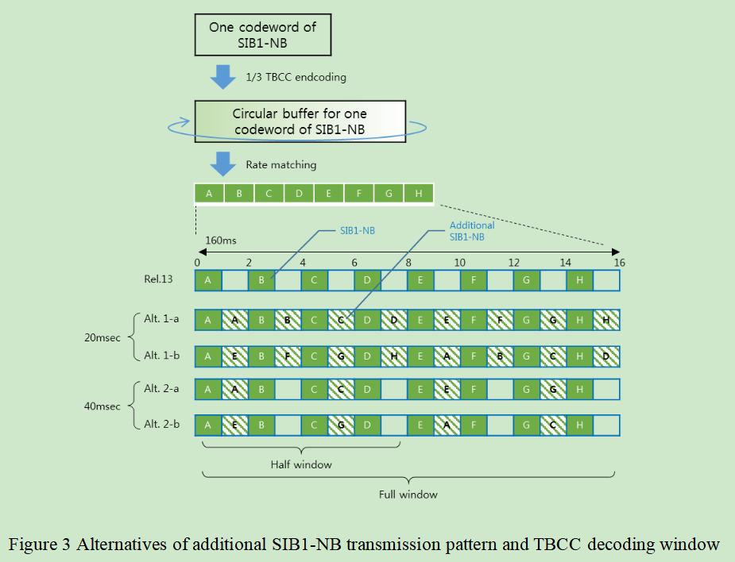
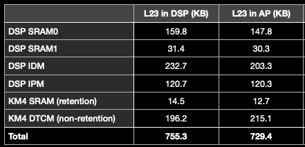

### 20211217
*   修改脚本rrc_diag.sh来parsing出branch_v31的serving cell distribution (for上海CT)
*   Tidy up关于PAPR vs RSSI的邮件，整理出actions，和owen讨论
*   gain change -84，需要等下周Ted看完
*   merge master的改动到branch 3.1 (关于收SI之前预留tracking cell search的时间)

### 20211218
*   [Git原理及使用](https://zhuanlan.zhihu.com/p/66506485)

*   [Git中rebase 和 merge 的正确使用姿势](https://zhuanlan.zhihu.com/p/93635269)
*   [Git Reset三种模式](https://www.jianshu.com/p/c2ec5f06cf1a)

*   [git ssh免登陆，以及ssh config](https://www.cnblogs.com/meitian/p/6776129.html)


### 20211220
*   上海QC test，CT cell分析，15/17的概率，同一个cell，MIB解不好
*   请假半天
*   帮忙刘璐看POWER_PROFILING_LOG的问题
*   请教JY关于SD-RDP的事情，是远程桌面使用vscode的

### 20211221
*   MIB的combine次数调整成128，去看BB实际会用到的次数，lockf到(2506, 271)
    > 从之前的结果来看，BB有效的合并次数在某些条件下没有被满足，不同周期里mib的sub-block不会被soft combine

    > 看起来lock过去后，SI都解不下来，attach做不成功
*   试用owen提供的jenkins job去trigger北京QC
    > 卡住在download image，130的jenkins那边的credentials改成了开机(签核)密码，待确认

### 20211222
*   新增苏州两台PC和深圳PC的jenkins client
    > 有请IT帮忙开通实验室可以访问130的jenkins网页
*   lockf到(2506, 271)，比对试验：combine次数加到最大为128 vs 保持原有mainline的combine次数不变的数据整理


### 202111223
*   针对苏州multi board，create多个user，并enable多个jenkins-slave.service，可以work，
    > 但JY的提议是不需要多个user，而是用container来区分，也能解决同一台电脑的tshark用不同的database去parse talog的问题
*   Ted组织meeting，关于MIB pass rate只有85%的问题
    > 1.看起来CS看到的strongest cell(NSSS)和common path看到的SNR最好的cell(NRS)存在mismatch的地方
    > 2.需要再做对比试验：解MIB时对准640ms的frame boundary，只要成功解下来一次MIB，就可以知道serving cell的system frame讯息

### 20211224
*   生成patch做对比实验
    > 1.在align serving cell时候，suspend MSG task，然后做300次MIB，对齐640ms的frame boundary
    > 2.上述1.在苏州可以work，但是在上海不能work，因为没办法前进到收到SIB2这一步，所以只能在MIB pass后，suspend MSG task
    > 3.上述2.在苏州可以work，最多可以前进到240次MIB做完，但上海lock过去cell的MIB pass rate很低，不确定是天线位置有变还是说tracking做的太少，还是说跟醒睡有关(sleepmode为2)，从结果来看，前10次还都是CRC pass，后面就CRC fail占70%，预计周一要调整一下变因看看，或换一个cell看看
*   和owen提QC需求，请他新增临时可以控制某台PC跑QC的功能，而不是一旦trigger，所有的PC都会一起run；以及trigger QC时，可以自己下config
    > 问题1：130上trigger qc，是省去了ftp那一路，那么image从何而来？还是说不需要image，直接就跑case？
    > A：给出RELEASE_NAME为CN3WD7_COOPER-Test-1783-2021_1228_1056格式的folder，会自动去该folder里面去捞image(ftp)，USER_NAME填自己的account

### 20211227
*   生成patch做对比实验
    > 上海lock过去cell的MIB pass rate很低，不确定是天线位置有变还是说tracking做的太少，还是说跟醒睡有关(sleepmode为2)，从结果来看，前10次还都是CRC pass，后面就CRC fail占70%，预计周一要调整一下变因看看，或换一个cell看看
    > 1.由于timing没重找，mib解出来一次后，一直做300次，就很有可能後面一旦出問題就沒救了，變成不是indenpendent trial
    > 2.由于没有align serving cell，没有补进analog，所以一直靠digital
    > 3.换苏州的cell，(2509, 143)，对不对齐640ms，没有特别明显的差异，因为現在是camp on一個訊號好的cell，所以很快就能解下來，不對齊的case其實有可能也都是沒有跨過640ms的
    > 4.强制不对齐640ms，比如630ms处去收MIB，苏州再换cell(2509, 269)，对齐和不对齐640ms结果也是有好有差

### 20211228
*   生成patch做对比实验
    > 1.强制不对齐640ms，比如570ms处去收MIB，苏州lock到cell(2509, 269)，对齐和不对齐640ms结果依旧是有好有差
    > 2.切换到callbox上，SNR配置成-13dB，combine count的差别在63-57+1=7附近，对齐的combine count为27.5，不对齐(570ms)的是33.5，和BB的说法相符
    > 3.目前将combine count调整为原先的2倍即可
*   branch v2.0收SI时计算duration有问题，RRC stop SI req后，需要将GetSiBitMap设为0
*   在SDN里make cdex时，需要先clean掉，不然不会被update
*   帮owen commit：rrc diag update for extending coreid to support different branch
*   协助harris并发实验

### 20211229
*   Reduced system acquisition time

### 20211230
*   Reduced system acquisition time
    > 1.和casey讨论SIB1的子帧3和子帧4如何combine的问题
    > 2.API: l1cPhyNpdschInit以及函数npdschInitializationRTK
    ```sh
    if (infoType!=2)
        pL1NpdschRxData->localRep = 1; // 这边注意后面要改成Nrep
    else
        pL1NpdschRxData->localRep = (Nrep > 4) ? 4 : Nrep;
    ```

### 20211231
*   Reduced system acquisition time
    > 1.把additionalTransmissionSib1放在L1C_SIB1_SCHEDULING这个struct里，由于解background SIB1的时候，background MIB不会送给上层，所以拿不到additionalTransmissionSIB1，只能从raw data取得
    > 2.解到MIB后的(npbchDecodeResult.npbch[2] & 0x01)就是
    .... ...0 additionalTransmissionSIB1-r15: False
    
    > 3.更新programTime和l1cSetRxPreprocessConfig的时间

### 20220104
*   Fix the compile warning about MIB/SIB1/SI
    > 1. 防止使用负的数组下标，[解决 array subscript has type char 错误](https://blog.csdn.net/sjygqz/article/details/106583420)
    
*   Commit the code (Reduced system acquisition time) to the master with the macro <font color='red'> ENABLE_R15_ADDITIONAL_TRANS_SIB1 </font>

### 20220105
*   Improved latency - UE specific DRX
*   听ethan_xu汇报关于dump NPSS IQ的相关内容

### 20220106
*   Improved latency - UE specific DRX
    > 和casey讨论关于CSS overlap的含义，应该是表示当ue-SpecificDRX-CycleMin被使用时，PCCH configuration中的npdcch-NumRepetitionPaging-r13不能太大，导致search space overlap的情况
    
*   zoey_yang汇报关于R15 feature的相关内容

### 20220107
*   Presence of NRS on a non-anchor carrier for paging
    > ***R1-1903914 NRS presence on non-anchor carriers for paging Huawei, HiSilicon***
    > 和casey讨论关于NRS的的位置是在PO前的第10th个DL subframe开始
    >> * 原因1：不同UE PO group(当Ns=4时，PO=0，4，5)里面PO前的DL subframe上的NRS可以被某个UE(当Ns=4时，该UE的PO=9)使用
    >> 
    >> * 原因2：为了满足NRSRP measurement，有做过SNR accuracy的simulation，PO前和PO后的DL subframe个数加起来要为8~10个
    >
    > ***R1-1903896 Presence of NRS on a non-anchor carrier for paging in NB-IoT Ericsson***
*   查找CR ***R2-1818628***：关于 ***additionalTxSIB1-Config*** 和DL subframe的关系，更新PPT，有待讨论
*   回顾zoey_yang的document：Code Review of EDT

### 20220110
*   和emma/casey讨论关于SIB1的combine次数是否有需要enlarge为2倍
    > 对比MIB的combine次数之前有enlarge为2倍的情况，BB在combine时，不同640ms的data不会拿来combine，原因是两个不同640ms的mib信息是不同的，编码后整个mib就是不同的，combine时合并的是软信息(表示为0或1的可能性大小)，如果原始的0/1数据并不相同，没法简单地直接把软信息相加
    > 对于解SIB1的时候，由于已知MIB里的系统帧信息+低2位的hyper帧信息，所以SIB1这边在enlarge combine次数时，一旦发现初始计算的combine次数跨过了2个hyper boundary，就需要调整
*   L1C bi-weekly周会

### 20220111
*   和casey讨论并且commit code：关于有条件地调整SIB1的combine次数
*   关于 ***additionalTxSIB1-Config*** 和DL subframe的关系，和casey确认理解：除非additionalTxSIB1-Config配成true，否则UE不应该在不包含SIB1的子帧3上monitor下行相关的NPDCCH/NPDSCH
    > ***<font color='red'> 36.213 16.4 Narrowband physical downlink shared channel related procedures </font>***
    except when the UE is configured with higher layer parameter additionalTxSIB1-Config set to TRUE, subframe #3 not containing additional SystemInformationBlockType1-NB transmission is assumed as a NB-IoT DL subframe if the UE monitors a NPDCCH UE-specific search space or decodes NPDSCH transmission scheduled by NPDCCH in the UE-specific search space.
    > 
    > ***R2-1818628***
    However, the scenario of initial connection establishment hasn’t been covered by the current specifications. For a R15 UE that supports additional SIB1, the UE would always assume there exists dedicated transmission for it in subframe #3 not containing additional SIB1 after reception of Msg4. But for eNB, after transmission of Msg4 and before end of UE capability acquisition, the eNB would not schedule dedicated transmission on the subframe #3. The UE may incorrectly monitor NPDCCH and decode NPDSCH transmission, and finally failure to receive the downlink messages. Then for example, the UE capability acquisition procedure or RRC reconfiguration procedure may fail.
    > 
    > Therefore, the UE that supports additional SIB1 cannot assume by default the subframe #3 not containing additional SIB1 transmission as valid DL subframe. An explicit indication to UE would be needed. The UE can assume the subframe #3 not containing additional SIB1 transmission as valid DL subframe only after it obtains the indication from the eNB. For the eNB, it can set such indication for indicating subframe #3 as valid DL subframe in RRC message, e.g, Msg4 only after it acquires the UE capability.
*   Release RAM space for R15 meeting by Ted

### 20220112
*   Review the code about VPHY R15
*   Study the spec 36.211/36.212/36.213 of R15
*   Build image for [NBIOTCOPER-2809](NBIOTCOPER-2809)
    > build cooper时，需要先执行./clean.sh，否则会报错
    > 再执行MODEM_DIR=/SDLC/usr/RSDOMAIN/manda_tang/code/modem ./build_cooper_tracker_pet.sh
### 20220113
*   Study the test cases in 36.523-1
*   安装Docker in Beijing/Shenzhen PC
    ```sh
    sudo apt install docker.io
    sudo usermod -a -G docker jenkins
    sudo sh -c 'echo "{ \"insecure-registries\": [\"172.26.5.129\"] }" > /etc/docker/daemon.json'
    sudo systemctl restart docker
    ```
*   WUS(wake-up signal)相关meeting调查
    > ***RAN WG1 #92bis：Final_Minutes_report_RAN1#92b_v100***
*   sudo systemctl <font color='red'>start</font> jenkins-slave.service
    > 需要将agent.jar的user改为：/home/jenkins$ sudo chown <font color='red'>jenkins:jenkins agent.jar</font>
    > 
    > 在sudo systemctl <font color='red'>enable</font> jenkins-slave.service之后，手动执行start service的动作或者restart PC
*   协助casey在SDN内安装vscode-cpptools，版本需为1.8.0-insiders2
    > [vscode-cpptools 1.8.0-insiders2](https://github.com/microsoft/vscode-cpptools/releases/tag/1.8.0-insiders2)
*   checkout branch ***phy_save_ram***，后续需要将MIB/SIB1/SI的code搬到Flash

### 20220114
*   将MIB/SIB1/SI/Drx/Resource manage的code搬到Flash
*   WUS(wake-up signal)相关meeting调查
    > ***R1-1803867 On configurations and procedures of power saving signal Huawei, HiSilicon***
    > Proposal 3: The list of values of configured maximum duration of WUS is  valid subframes.
    > And we also propose that the configured maximum duration of WUS is defined in the number of valid subframes, which is similar with the definition of Rmax.
    > 
    > ***RAN WG1 #92bis：Final_Minutes_report_RAN1#92b_v100***
    >> Agreement
    > WUS is postponed in subframes that are not NB-IoT DL subframes and is not transmitted [FFS dropped/postponed] in the subframes that carries SIs other than SIB1.
    >>> Note: “Postpone” means the corresponding subframes are not counted as configured maximum WUS transmission duration and actual WUS transmission duration.
    >>> Note: This does not imply that the minimum gap between the end of actual WUS duration and the first associated PO is reduced

### 20220117
*   协助ethan_xu cherry-pick from master to branch 3.1
    > git commit --amend的使用
*   revert掉：Drx/Resource manage的code搬到Flash
    > connected下会用到的函数暂时不适合搬到flash
*   profile MIB/SIB1/SI模块中各个state用到的cycle count (for master)
*   EDT/Format2 参数handle

### 20220118
*   RS-PC-3、RS-PC-4的jenkins-slave service的secret key设置错误，导致断连
*   配置VS-code的remote-ssh不用输入密码
    > 1.在10.22.13.104中输入ssh-keygen
    > 2.将生成的id_rsa-remote-ssh.pub copy到10.22.13.24中的~/.ssh/
    > 3.打开VScode配置SSH config，在最后一行添加IdentityFile，(每台Host底下都要写)
    >>```sh
    >>IdentityFile ~/.ssh/id_rsa-remote-ssh
    >>```
    > 4.在10.22.13.25中执行：
    >>```sh
    >>cat id_rsa-remote-ssh.pub >> authorized_keys
    >>```
*   profile MIB/SIB1/SI模块中各个state用到的cycle count (for master vs branch phy_save_ram)

*   EDT/Format2 参数handle (60%)
*   jira记录：使用at command去控制release version [NBIOTCOPER-2816](https://jira.realtek.com/browse/NBIOTCOPER-2816)

### 20220119
*   [NBIOTCOPER-447](https://jira.realtek.com/browse/NBIOTCOPER-447)
    > 有看到702640 MSG_ID_LTE_PHYARRC_DIRECT_IND_INFO_IND
*   narrow down [NBIOTCOPER-2817](https://jira.realtek.com/browse/NBIOTCOPER-2817)
*   36.304 V16.5.0 Chapter 7.6
### 20220120
*   36.304 V16.5.0 Chapter 7.5.1、7.5.2
*   学习wip的用法，git commit中需要带上
    >```sh
    >%ap_config=PET_TRACKER=1%
    >```
### 20220121
*   36.304 V16.5.0 Chapter 7.5.3、7.5.4
*   Group Wake up signal meeting调查
    > ***Final_Minutes_report_RAN1#90b_v100***
    > R1-1718141 Wake-up signal configurations and procedures Qualcomm Incorporated
    > R1-1719471 On configurations and procedures of power saving signal Huawei, HiSilicon
*   Sync with casey about nprach parameters in SIB22-NB and SIB23-NB

### 20220124
*   [NBIOTCOPER-2824](https://jira.realtek.com/browse/NBIOTCOPER-2824)
*   narrow down [NBIOTCOPER-2822](https://jira.realtek.com/browse/NBIOTCOPER-2822)
*   协助harris使用SDN
*   L1C bi-weekly meeting

### 20220125
*   [NBIOTCOPER-2825](https://jira.realtek.com/browse/NBIOTCOPER-2825)
*   EDT feature in spec 36.321 V15.11.0

### 20220126
*   36.523-1 V16.11.0 GCF case study
*   sync with lizzie about EDT/Fmt2 parameter
*   SIB1 decode fail in Taipei Dazhi office
*   学习assert/fail log dump from flash
*   review the difference of l1c_npbch.c between branch v2.0 and master
*   跟JY了解wireshark plugins(for windows platform)

### 20220127
*   [NBIOTCOPER-2827](https://jira.realtek.com/browse/NBIOTCOPER-2827)
    > 持续观察台北大直办公室是否还有该现象，该cell operation mode为guardband
*   查找资料：关于在子帧3(在特定配置下：repetition为16时)上传输SIB1的原因
    > ***R1-1712629,Reduced system acquisition time for NB-IoT, Ericsson***
    > Among the three NB-IoT deployment modes, the in-band deployment requires longer system acquisition time due to lower transmit power level and puncturing that may occur on NPSS and NSSS resources. Additionally, compared to the standalone and guard-band modes, NPDSCH subframes in the in-band mode have fewer available resource elements due to resources taken by LTE CRS or reserved for LTE downlink control region. This results in a higher coding rate and thus a lower coding gain and reduced reception performance of SIB1-NB and SI messages. Thus, improvement for system acquisition time reduction should primarily target the in-band mode. The solutions that can reduce the system acquisition time for the in-band mode can be directly applied to the guard-band and standalone modes as well.
    >
    > ***R1-1705188, “On system acquisition time reduction,” RAN1#88b, source Ericsson, 3 – 7 April, 2017.***
    > SIB1-NB acquisition performance can be significantly improved by combining across multiple SIB1-NB transmission periods within a SIB1-NB modification period and cross-subframe channel estimation.
    > 
    > ***R1-1712629,Reduced system acquisition time for NB-IoT, Ericsson***
    > On a Rel-13 NB-IoT anchor carrier, the percentage of resource elements available for NPDCCH/NPDSCH symbols, excluding those carrying SIB1-NB, is only 42% in the worst-case scenario (in-band, 3 OFDM symbols for LTE PDCCH, and 4 CRS ports). Using more NPBCH repetitions will further reduce the percentage of resource elements available for NPDCCH/NPDSCH.
    > Using more NPBCH subframes is not considered in Rel-15.
    > 
    > ***R1-1717278 System information acquisition latency enhancement	LG Electronics***
    > 
    > 
*   build target for POSIX platform

### 20220128
*   查找资料：关于在子帧3(在特定配置下：repetition为16时)上传输SIB1的原因
    > ***R1-1801445 Reduction of NB-IoT system information acquisition time Huawei, HiSilicon***
    >> * Alt.1 (same as legacy) [ Please note that the content in the brackets are added for the purpose of explicit reference in the following sections.]: the additional SIB1-NB uses the same coded bits-to-subframes mapping as the legacy SIB1-NB
    >> * Alt.2 (circularly shift): reuse coded bits generated for existing SIB1-NB transmission while coded bits-to-subframe allocation is circularly shifted as much as 8 radio frames compared to the existing SIB1-NB transmission
    >> * Alt.3 (continuing reading): the coded bits that are mapped to subframe #3 used for additional SIB1-NB transmissions are generated by continuing reading from the virtual circular buffer
    > 
    > ***Final_Minutes_report_RAN1#92_v100***
    > 

### 20220208
*   询问JY关于git reset (或rebase)把local branches重新對齊remote branches on SDLC-Gerrit
*   和王凤翔sync关于continue reading from the virtual circular buffer的含义
*   narrow down jira issue [NBIOTCOPER-2828](https://jira.realtek.com/browse/NBIOTCOPER-2828)

### 20220209
*   准备Additional Transmission SIB1的PPT(70%)
*   查找资料关于repetition number为4 or 8时，不采用additional transmission sib1的原因
    > 暂时没翻到曾经看过的：NW不预期认为UE是处于weak coverage，如果repetition number配置为4 or 8的话；并且在同样增加了system overhead的情况下，UE获得的benefit没有repetition number为16时那么大。

### 20220210
*   准备Additional Transmission SIB1的PPT (100%)
*   和勇哥sync关于PPT中Alt1./Alt2./Alt3.的performance问题
*   从R13到R16的5G物联网之路：Chapter 5

### 20220211
*   从R13到R16的5G物联网之路：Chapter 5
    > EDT feature (60%)

### 20220214
*   L1C bi-weekly周会
*   安装Pulse Secure
*   配置Teams on windows 11
    > 解决error:caa70007，[禁用代理服务器](https://www.biaopan8.com/8722.html)

### 20220215
*   Spec R16 36.304：Presence of NRS on a non-anchor carrier for paging
    > 理解The POs with associated NRS的物理意义 (40%)

### 20220216
*   查看相关R1-xxxxxxx proposal：Presence of NRS on a non-anchor carrier for paging
*   试用wireshark-rtk-ra-static
    > 1.旧的wireshark-rtk-ra需要purge 以及 ta.so和ta-dump.so需要删除
    > 2.Mint下打开wireshark闪退问题的解决办法：libcdex upgrade到1.3，JY有将llvm symbols隐藏起来
*   从R13到R16的5G物联网之路：Chapter 6
    > 理解The POs with associated NRS的物理意义 (70%)
    > 粗读Group Wake up Signal的物理意义 (40%)

### 20220217
*   read wireshark.md
*   和Dennis大概讨论enable_cooper_phy_lib在build cdex.database时的问题
    > 由于之后都会采用wireshark-rtk-ra-static，所以只需要.xml文件就可以解析log，这点跟logAssist2一样，而enable_cooper_phy_lib并没有free-struct.xml，所以需要修改makefile文件
    > 之前是cdex/client中通过.h同时生成.cpp和.xml，再拿到cdex/wireshark去生成.so
*   和Emma/Casey讨论有关收取SI的过程中上报out of sync的问题 (当UE处于静止时)
    > 1-a.reference SNR的设定问题，基于该reference SNR加上SNR的variance可以得到低于某个SNR，即可认为解不下来SI
    > 1-b.判定低于某个SNR的占比超过ratio的时间：每次repetition结束 or SI window结束 or tune
    > 2-a.需要BB提供 SNR variance for low SNR in ETU-5
    > 2-b.需要BB提供 ratio? (align to out-of-sync ratio?)

### 20220218
*   和Emma/Casey讨论有关收取SI的过程中上报out of sync的问题 (当UE处于静止时)
    > 确认BB提供的simulation仿真图的理解，是通过横轴看or纵轴看，当SNR = -15dB时，落入-12dB以下的概率为95%，落入-15dB以下的概率为50%，落入-18dB以下的概率为5%
    
*   和Casey讨论有关于EDT feature的物理意义 (70%)

### 20220221
*   从R13到R16的5G物联网之路：Chapter 6
    > 粗读Group Wake up Signal的物理意义 (80%)
*   需要确认RRC那边给定的BC timer(for SI)是否可以cover到4s的时间长度
    > periodicity = 640ms， window length = 480ms，repetition pattern = 2RF，cntPerWindow = 24，max combine count = 128，可以求得timer长度为(128 / 24 + 1) * 640 = 3840ms < 4000ms = 4s
    > ```sh
    > BC_UpdateSIWaitTimer()
    > u8 cntPerWindow = u16SiWindowLength[pMsg->si_WindowLength_r13] / (u8SiRepetitionPattern[pSchedulingInfo->value.MEMB(si_RepetitionPattern)]);
    > u32 newSIWaitTimer = ((MAX_SIB_RETRY_COUNT / cntPerWindow) + 1) * (u16Periodicity[pSchedulingInfo->value.MEMB(si_Periodicity)]); /* 1 is for compensation */
    > ```

### 20220222
*   Additional Transmission SIB1 report (Done)
    > 1.BB有提到选择Alt3的好处在于：对fading或是突发的干扰到来时，subframe #4和subframe #3相同位置的RE在频域方向的同一个子载波发生衰落，但由于传输的bit不同，所以鲁棒性更强
    
    > 2. Emma有补充说明：downlink bitmap是10bit和40bit两种配置(为了降低code rate以及向Rel-13/Rel-14兼容，不预期通过40bit来表明子帧3是否可用)，已知40bit可以框住40个子帧，而10bit只能表示1个radio frame，会不知道是奇数帧还是偶数帧，最终3GPP决定在没有进USS之前，子帧3对应的bitmap是0，所有的UE都不能拿子帧3来使用(收NPDCCH/NPDSCH)，等进了USS，网络端可以根据UE的capability，进行调整，flag拉起来，表示非sib1的那个子帧3可以用来收NPDCCH/NPDSCH
*   从R13到R16的5G物联网之路：Chapter 6
    > 粗读Group Wake up Signal的物理意义 (95%)
*   从R13到R16的5G物联网之路：Chapter 5
    > 粗读NPRACH Format 2 (20%)

### 20220223
*   从R13到R16的5G物联网之路：Chapter 5
    > 1.粗读NPRACH Format 2 (75%)
    > 2.small cell / mixed operation mode etc.
*   粗读EDT_R15 PPT
*   和勇哥讨论QC log：TC_9_3_2022.02.23-03.15.48.talog
    > tracking cell search提前做完，sleep 2s后再收MIB
*   和casey讨论SI early termination的相关理解

### 20220224
*   LTE meeting by Tim
*   从R13到R16的5G物联网之路：Chapter 5
    > 回顾EDT feature (85%)
*   branch rel15
    > trace the code difference between master and rel15 in vphy_ra.c

### 20220225
*   refine the NPRACH config about EDT and fmt2 in branch rel15
*   和casey讨论NPUSCH postponement when conflict with NPRACH resource

### 20220228
*   merge the flash log dump of PHY Statistic and System Info from master to SDK-release-v31
*   refine the TB size in RAR info and fix the bug about the repetition of Msg3

### 20220301
*   VPHY R15 SR feature
    > 1.store the dedicated configurations about SR
    > 2.process SR req from MAC

### 20220302
*   VPHY R15 SR feature
    > inform the start of SR prohibit timer to MAC
*   L1C weekly meeting
*   sync extended PHR with zoey_yang
    > 14dBm等价于Power class 6(36.101中Table 6.2.2F-1: UE Power Class)
    > PHR table需要参考 TS 36.133 Table 9.1.23.4-1A，Table 9.1.23.4-1，Table 9.1.23.4-2 

### 20220303
*   L1C EDT report by Casey
*   Sync SR feature with zoey_yang
    > 1.preamble的第一个子帧需要通知MAC，MAC取消pending的SR
    > 2.preamble的最后一个子帧需要通知MAC，MAC开启SR prohibit timer
    > 3.commit by version **mainline_rel15 cb163374**
*   查找R15中DRX on duration timer的相关CR (Done) (Rel-14中L1C已经实现)
    > ***RP-192941***
    >> For NB-IoT, onDurationTimer may start within a PDCCH period and end within a PDCCH period. The UE shall monitor NPDCCH during these partial PDCCH periods while onDurationTimer is running.
    >
    > ***R2-1914475*** (***meeting R2-2000009***)
    > **onDurationTimer**
    >> All companies agreed that since this timer may not always be aligned to a PDCCH period due to drx-StartOffset partial search spaces should be supported for this timer. 3 companies commented that additional clarification may needed as to how monitoring and scheduling should work for partial search spaces with this timer.
    >>> Observation 1: Clarification is needed to the MAC specification to capture expected behaviour when onDurationTimer encompasses partial search spaces.
    >>> Proposal 1: From RAN2 point of view, partial search spaces are supported for onDurationTimer in NB-IoT.
    >>> Proposal 2: Behaviour when the NW can schedule the configured number of PDCCH candidates in either the starting partial search space or the ending partial search space to also be captured in the MAC specification.

### 20220304
*   debug dump flash log on branch 3.1
    > MSG_ID_LTE_PHYADP_MONITOR_RPT_IND到ID_ADP_MonitorInfo的过程，栏位可能有问题
*   和Casey讨论SI early termination
*   协助Ted debug QC test 9 在iteration=1时assert的问题(branch phy save ram)
    > timeout_value需要设成4 hour，原本3 hour来不及跑完
*   协助勇哥抓branch 2.0的talog
    > at^setlog=1需要打开

### 20220307
*   trace jira issue [NBIOTCOPER-390](https://jira.realtek.com/browse/NBIOTCOPER-390)
    > 漏解DCI N1
*   Assert：vphy_actionlist.c 373 when running 22.4.2 after ENABLE_SR_CONFIG is true
    > fix by branch mainline_rel15 d8a9fced
*   git rewrite history (Doing)
*   协助Ted升级CMW500
    > 36.523-2的table中有UE feature vs GCF test case
    

### 20220308
*   trace jira issue [NBIOTCOPER-2853](https://jira.realtek.com/browse/NBIOTCOPER-2853)
    > 1.SI解到112次还没解成功，max iteration count预留的是128，(根据当时SNR 在-13dB左右求得的)
    >> a.9406这个earfcn，402比57的SNR要好，但是cell search看到的是57好，所以报给RRC
    >> b.当前这个scenario，后期或许可以通过SI early terminate，out of sync做一些解套(RRC那边無法透過s criteria解套)
    >
    > 2.此外发现，单独在学姐那台PC跑parser的脚本，会遇到如下问题：./rrc_diag.sh: line 3203: *10: syntax error: operand expected (error token is "*10")
    >> owen将.so重新移除之后遇到的问题和下述3.一样
    >
    > 3.在local电脑跑rrc_diag.sh会报错：
    > tshark: Some fields aren't valid: primitive.Message_t.MSG_LTE_PHYRRC_FIND_CELL_CNF_t.cellResult.nrsSnr primitive.Message_t.MSG_LTE_OSPEMM_TIMER_EXPIRY_t.u32TimerMsgType
    >> a.大神单独执行tshark -r sanity.talog -Y "frame.number == 2843" -V是可以show出来cellResult.nrsSnr
    >> b.primitive.Message_t.MSG_LTE_**PHYRRC**_FIND_CELL_CNF_t.cellResult.nrsSnr vs primitive.Message_t.MSG_LTE_**PHYARRC**_FIND_CELL_CNF_t.cellResult.nrsSnr
    >> c.primitive.Message_t.MSG_LTE_**OSPDC**_TIMER_EXPIRY_t.u32TimerMsgType vs primitive.Message_t.MSG_LTE_**OSPATM**_TIMER_EXPIRY_t.u32TimerMsgType
    >> d.fieldAs的#14-31数目不可变，否则会烂掉
*   git rewrite history (Done)
    > 修改权限，并且push时加上：git push --force
    
*   协助harris build tracker image

### 20220309
*   协助杨影build titan source code
    > 没有安装asn1c-rtk
*   确认codegen(wireshark-non-static)的问题
    > primitive.Message_t.MSG_LTE_**OSPDC**_TIMER_EXPIRY_t.u32TimerMsgType vs primitive.Message_t.MSG_LTE_**OSPEMM**_TIMER_EXPIRY_t.u32TimerMsgType
*   协助harris build tracker image
    > 重新生成id_rsa.pub，并将其放在gerrit user为manda_tang的SSH Public Keys那边
*   trace the commit about non-anchor feature
*   了解温补PPT

### 20220310
*   trace jira issue [NBIOTCOPER-2857](https://jira.realtek.com/browse/NBIOTCOPER-2857)
*   温补report by ethan_xu
*   跟jimmy学长了解L23搬到KM4的相关事宜
    ```sh
            RRCPHY message                   L1C message
    RRC <--------------------> RRC ADAPT <-----------------> PHY
    ```
    > 現在 RRC ADAPT 執行 LNB_xxxx()，LNB_xxxx() 裡面會打包成 L1C message 用 freertos api 送給 L1C task，L1C task 收到 L1C message，解讀 osp header 來判斷該執行哪一個 handler function
    > RRC ADAPT 移到 KM4 時，可能會這樣改：RRC ADAPT 執行 LNB_xxxx()，LNB_xxxx() 裡面會打包成 L1C message 用 Osp_Send_Msg 送給 L1C task，Osp_Send_Msg 就能穿越 apcc
    > 改變 L1C message 格式，的確就是改成 osp header

### 20220311
*   DSP移除L23 build
    > An Introduction to Build/Option System by JY(20/55)
*   整理mail：关于ID_ADP_MonitorInfo中eventRecord栏位显示不对的问题
    > 1.apt package cdex更新到1.7版本
    > 2.database请使用modem SDK-release-v31:96a36fa之后生成的

### 20220314
*   DSP移除L23 build
    > An Introduction to Build/Option System by JY(55/55)
*   L1C bi-weekly meeting
*   和casey trace关于MAC选择non-anchor carrier nprach resource
    > sib22中的配置 UL carrier 数 != Nprach resource数（NPRACH_ParametersList）如果 UL carrier 个数 = 5， Nprach resource 个 数=4 (对应到code里： u8AvailCarrierIndex 取值范围 1，2，3，4)
    UL carrier index = 1，2，3，4，5nprach resource 存在于UL carrier index上 1，2，4，5
    假如random之后，得到的u8AvailCarrierIndex =3，
    这时候进入for循环做完 最终得到的u8CarrierIndex = 3，但预期应该要是4才对
    只要 random之后选择的UL carrier index对应的前一个carrier index没有nprach resource，就会出现上述问题
    相当于少loop一次，u8CarrierIndex少加了1
    ```sh
    diff --git a/L23/MAC/NBIOT/Source/mac_ra.c b/L23/MAC/NBIOT/Source/mac_ra.c
    index 3d6967d13..11a88ce32 100644
    --- a/L23/MAC/NBIOT/Source/mac_ra.c
    +++ b/L23/MAC/NBIOT/Source/mac_ra.c
    @@ -185,8 +185,8 @@ void MAC_RaResourceSelect(MSG_LTE_MACAPHY_PREAMBLE_SEND_REQ_t * pstrucSelectResu
    if (u8AvailCarrierIndex > 0)
    {
    - for (pstruUlConfigCommon = strucInitCfgInfo->ulConfigCommonList, pstrucMacEntity->strucRaPara.u8CarrierIndex = 1;
    - u8AvailCarrierIndex > 1;
    + for (pstruUlConfigCommon = strucInitCfgInfo->ulConfigCommonList, pstrucMacEntity->strucRaPara.u8CarrierIndex = 0;
    + u8AvailCarrierIndex > 0;
    pstruUlConfigCommon = UL_ConfigCommonList_NEXT(pstruUlConfigCommon), pstrucMacEntity->strucRaPara.u8CarrierIndex++
    )
    {
    ```

### 20220315
*   DSP移除L23 build
    > 1.试着新增SWCFG去build(监狱外用--enable-cooper-phy-lib)
    >> 监狱里有遇到问题，关掉USIM task会报错
    >> 
    > 
    > 2.和jimmy学长确认实作方向
    >> 确实是改动configure.ac (L23的code不会移到cooper_sdk文件夹，就像APP/AMIF, ap_cc.c 沒有移到 cooper_sdk 資料夾去)
*   commit R15 feature to branch_rel15：EDT and Fmt2 parameter

### 20220316
*   和BB sync l1cPhyNpdschInit interface是否需要调整：暂时不需要改动
    > numSubframe == 16 && infoType == L1_NPDSCH_CARRY_BCCH 就等价于 additional SIB1的情况
    普通 SIB1 numSubframe == 8 && infoType == L1_NPDSCH_CARRY_BCCH
    普通 SI   numSubframe == 2 或是 8  && infoType == L1_NPDSCH_CARRY_BCCH
    普通 NPDSCH numSubframe ==  任何值 && infoType == L1_NPDSCH_NOT_CARRY_BCCH
    相当于 只要新增一个条件 numSubframe == 16 就可以判断出 additional SIB1了
*   commit R15 feature to branch_rel15：additional SIB1 Transmission
*   fix compile error in branch_rel15
    > 
    > dennis为将#include "osp/osp_def.h"从adp_ps_interface.h移除了，导致l1c_primitive_handle.c没有包FreeRTOS.h而报错

### 20220317
*   DSP移除L23 build
    > 1.a) 跟jimmy学长sync关于是否要移除USIM task + driver，追查
    選擇不要打開ENABLE_SIMC_TASK--->因為ENABLE_SIMC_TASK 根本不去 build hal_dsp_simc_new.c
    但在./configure_COOPER_xxx时，加了USIM == USIMC，
    power_clock 那边有判断条件：
    
    把这个改成了条件是 ENABLE_SIMC_TASK ，虽然是能过 ，但是我觉得怪怪的
    假如没有ENABLE_SIMC_TASK ，在./configure_COOPER_xxx时，能直接写成USIM == USIM_SIMULATOR吗(直觉好像是不能)
    同步都改成用ENABLE_SIMC_TASK 包的话，与此同时下面也跑不到power_SIM_LDO_switch_on了，这应该会有问题吧？
    
    > 1.b) 结案在
    因為 ENABLE_SIMC_TASK 與 USIM_SIMC 的關係，在 configure.ac 裡已經描述了
    但，現在特別去改變它
    結果出現這樣的 error
    追下去也許會得到這樣的敍述： 在 TARGET_COOPER 裡, USIM_SIMC 就是不能沒有 SIMC_TASK
    為什麼你一定不要這樣
    規則就寫好了
    > 
    > 2.将USIM留在DSP，会遇到跟L3_COMMON扯上点关系(USIM 会去调用 L3_Send_Msg)

### 20220318
*   [ ] DSP移除L23 build
    *   将USIM留在DSP，会遇到跟L3_COMMON扯上点关系(USIM 会去调用 L3_Send_Msg)
        *   [x] 临时workaround掉
    *   打开ROHC_RTK，会报错，PDCP会调用ceva security lib
        *   [x] 勇哥说肯定会用纯软的方式实现security
        *   [x] pdcp.lib 是 KM4 build, rohc.lib 是 CEVA build，兩個 lib 不會合的
    *   dennis 有提醒在移除了L23 lib后，那么L23曾经使用的Heap需要确认去向

*   和dennis sync关于COREID中的含义，下列用法类似于enum：
    > ```sh
    > [MULTICORE_AP_L123],
    >    [CHOICE_GROUP_START([COREID], [COREID_L123])
    >        DEFINE_CHOICE_NO_COND([COREID_L123])
    >        DEFINE_CHOICE_NO_COND([COREID_L23], [COREID_L123])
    >        DEFINE_CHOICE_NO_COND([COREID_L23_MAIN], [COREID_L123])
    >        DEFINE_CHOICE_NO_COND([COREID_L23_NUM])
    >        DEFINE_CHOICE_NO_COND([COREID_L123_NUM], [COREID_L23_NUM])
    >        DEFINE_CHOICE_NO_COND([COREID_NUM], [COREID_L123_NUM])
    >        CHOICE_GROUP_END([COREID])])
    > ```
    > 可能需要找jimmy学长确认
    > ```sh
    > struct sfifo_rec_ptr_2 *g_struPlatCommFifos[PLAT_COMMFIFO_NUM][PLAT_COMMFIFO_NUM] = {{NULL}};
    > ```

### 20220321
*   [ ] DSP移除L23 build
    *   ENABLE_NVM 可以不用
    *   SERIAL_PORTS="LOG: AT:"，不用 AT
        > SERIAL_PORTS 應該是讓 configure 產生出一些 macro去影響 PLAT_UART 要弄出幾個 port，其中又有幾個是給 AT 使用的，AT 整個都在 KM4，因此 DSP 不應該需要有個 UART port 是給 AT 用的
    *   ENABLE_AT_AP，打开，主要是要影響 SFU ID
        > modem/include/swconfigs/common/lte_tasktype_comm.h
        KM4 build 也需要看 modem/include/swconfigs/common/lte_tasktype_comm.h
        兩邊對於 SFU id 才會有共識，inter-core message，MsgType 就包含了 SFU ID，destination, source
*   [NBIOTCOPER-2866](https://jira.realtek.com/browse/NBIOTCOPER-2866)
    > 提供由time align task通知SI的 API
    > 实作API，需要找Casey double review
*   大概review了一下resource.h中的ENABLE_XXX是否符合预期，待完成

### 20220322
*   [NBIOTCOPER-2866](https://jira.realtek.com/browse/NBIOTCOPER-2866)
    > 找Casey double review patch，需要考虑当处于SI_Proc的state时，突然停掉SI后，pSiInternal里的相关变量是否有重新reset
*   PK 动员大会 by Paul
*   找Dennis sync如何解决USIM task会用到L3_SendMsg和L3_Alloc_Msg_Impl的问题
    > 1.commit error是因为包macro时写成了
    > ```sh
    > #ifdef SWCFG_PHY_ONLY
    > ```
    > 2.决定在l3_com.h中通过macro enable这两个function，会生成libl3common.lib
*   协助Harris看branch v3.1的log，发现Rmax配置为128

### 20220323
*   找Dennis sync如何解决USIM task会用到L3_SendMsg和L3_Alloc_Msg_Impl的问题
    > 1.通过#error去测试是否真的有包到这两个function
    > 2.新定义ENABLE_L3_COMMON，表示当ENABLE_L3和ENABLE_SIMC_TASK都打开时，会去生成libl3common.lib
    > 3.在../configure.LM3S6965EVB_APP_COOPER_LOG_TA LOG=LOG_TA TA_CORE=TA_MULTICORE --disable-dependency-tracking时，make不会报错，但生成cdex会遇到error，需要将l3_com.h里的structure或typedef释放出来，因为modem.base/tools/cdex/client/primitive/target.h会用到L3_PSM_Status

### 20220324
*   找Dennis sync如何解决USIM task会用到L3_SendMsg和L3_Alloc_Msg_Impl的问题
    > 1-a).daily test error (../configure.WIN32_L1C  --disable-dependency-tracking)，追查发现是因为TARGET_WIN32:USIM_SIMC会开启ENABLE_SIMC_TASK，而TARGET_WIN32在不属于SWCFG_L23_UT时，默认都打开了USIM_SIMC
    > ```sh
    > ../../L23/L3COMMON/Source/l3_com.c: In function 'L3_Alloc_Msg_Impl':
    > ../../L23/L3COMMON/Source/l3_com.c:1561:9: error: 'NB_POOLID_MSG' undeclared > (first use in this function)
    > 1561  | NB_POOLID_MSG, MsgSize - sizeof(OSP_STRU_MSGHEAD), MsgType, > failHook);
    >       | ^~~~~~~~~~~~~
    > ```
    > 1-b).使用命令去测试daily test：tools/cmgk_scripts/build_test --build-list tools/cmgk_scripts/daily_test.json ^WIN32.*
    > 2.精简configure.COOPER_MULCOR_APL23_PHY_LOG_TA的内容
    > 3.SWCFG_PHY_ONLY不应该出现在Makefile.am里，这违背了設計的原意
    >> SWCFG 和其他設定，決定出哪些模組要，哪些模組不要
    >>而不是在各個模組的 Makefile.am 去判斷 SWCFG，這樣會列舉不完
    >>當選擇了 SWCFG_PHY_ONLY configure 會決定不需要 ENABLE_UAIL23/NAS/UAI/Makefile.am 裡直接都變成空的了
    >>```sh
    >>#=========================================================================>>======
    >># Automake variables
    >>#=========================================================================>>======
    >>if ENABLE_UAI
    >>noinst_LIBRARIES += libuai.alibuai_a_CPPFLAGS = \
    >>-I$(srcdir)/ADP/INC \...
    >>```
*   jenkins 的 daily_cooper test 能夠 release 出 SWCFG_PHY_ONLY 的 build，找JY申请权限，commit时只需要直接git push
*   可以確認一下幾個 L23 task 的 entry function，應該都不在了，fw.bin 變小多少
    > cooper_mulcore_apl23_phy_build.tar.gz 裡面應該有打包進 fw.bin
        也可以直接和 cooper_release.tar.gz 的 fw.bin 來比檔案大小，
        它會老老實實地被寫進 flash，它大，在flash 裡佔地就大
        **before：1206KB，after：443KB**
*   Dennis的Req中：处理AT那边L3_SendMsg的事情
    > 发现ATM那边使用的msg最早就是ATM_SendReq和ATM_Alloc_Msg
*   Sam提供的资讯，128k(PTCM)，256k(ITCM)，192k(SRAM)这三个是固定不变的，因为掉电以后，再上电回来，需要从flash中的这三块内容的资讯一一copy到实体上的真正位置(PTCM，ITCM，SRAM)去
    > 

### 20220325
*   会需要有一个lte_tasktype_comm.h的中間版本才有機會做測試，可以看到这边的_STUB后缀，
    > 如果沒有補進那些 _STUB 的 sfu id，也就是接近最終版本的 lte_tasktype_comm.h，
    "没有移除 L23 的 DSP binary" 與 KM4 對於 sfu id 的認知整個不同，DSP 送到 KM4 的 message，KM4 誤會來者何人，一直 assert

*   review [NBIOTCOPER-2866](https://jira.realtek.com/browse/NBIOTCOPER-2866)的talog
    > align serving cell task在子帧98/1开启；
    > 98/2去claim resource，调用time align task通知SI的API，SI abort tracking，release SI的resource，不过tracking那边没有release tracking相关的resource，被callback后又切回state claim resource；
    > 98/3去claim resource，调用time align task通知SI的API，assert，不过因为还没前进到resource manage，所以可以看到state切为了align cfo sto

### 20220328
*   L1C bi-weekly周会
*   trace L1C的相关修改
    *   [NBIOTCOPER-2864](https://jira.realtek.com/browse/NBIOTCOPER-2864)
        > 发生assert的时间点都是RA fail之后且期间DSP有睡到state3再次打TX时，再次打TX时打开APT会polling不到apt_core_bg_ok，于是就发生assert。目前怀疑的问题点是第一次RA fail之后并没有关掉APT，导致第二次需要打开APT时PC_Set(PC_POWER_APT, PC_ON)以及PC_Set(PC_AONSIFC_ISO_APT, PC_ON)都没有重新动作，可能会导致APT开不起来
        > 
        > 在release common config時關掉APT，原因如下：
        1.省電，若非由L1C主動關掉，遇到睡不到light sleep的場景(e.g., 被config DRX 1.28s但某次建連失敗)可能會多耗電
        2.原先code裡在release common config時L1C有記錄要關(或預期可能會被關)，但實際上沒關，修正此不一致性
    *   [NBIOTCOPER-2868](https://jira.realtek.com/browse/NBIOTCOPER-2868)
        > CSS1下重複schedule NPDCCH而assert
        (673,307,0) 因為遇到DL gap，因此預先往後排NPDCCH(0) at (673,320,1)
        (673,307,2) 解到DCI_N2
        (673,307,3) schedule NPDSCH at (673,320,1)
        (673,307,4) NPDCCH(0) resource conflict而重排NPDCCH(1)
        (673,320,2) Decode NPDSCH
        (673,320,3) schedule NPDCCH(2)
        不預期會同時存在兩筆NPDCCH scheduling，assert的場景要避免排NPDCCH(1)
        因此會調整成CSS1 resource conflict時，會先檢查是否已schedule下一筆RX，scheduleList是空的情況才去排下一筆RX

### 20220329
*   trace L1C的相关修改
    *   DL-Bitmap on non-anchor carrier
        > string:"1011100011" (small endian 高位放在高地址)
        > [1]: 00000010
        > [0]: 11100011
        > ```sh
        > pDlCarrConfigR14_OR->DlBitmapNonAnchR14.usSubframePattern10 = (unsigned short)(DL_CarrierConfigCommon_DL_Bitmap(dl_CarrierConfig, subframePattern10)[1] << 8) + DL_CarrierConfigCommon_DL_Bitmap(dl_CarrierConfig, subframePattern10)[0];
        > ```
    *   NRS on Non-anchor Carriers
        > fix find NRS opportunity for CSS1/CSS2 non-anchor
        1.when monitor CSS1/CSS2 NPDCCH,shall be NB-IoT DL subframe
        2.for CSS2 NPDSCH and others, need consider #0, #4, #9 and DL subframe
        > 
    *   L1C_CONVERGENCE_MODE_PAGING：表示是CSS1 and anchor carrier，会进行NSSS和NRS的combine；如果是L1C_CONVERGENCE_MODE_NORMAL，表示是CSS1 and non-anchor carrier，此时会有uncertainNrs
*   用[daily_cooper_165](http://172.26.5.130:8080/job/SDN/job/modem/job/daily_cooper/165/)的bin与cooper_sdk branch l23ap_dev去合，生成的image有问题，进监狱重新build，会跑出跟Ted一样的结果：
    > 1.发生MPU exception是因为 Plat_ChecksumProtect--->Plat_AreaChecksumDerive摸到了一个非法的address：0x200c8000,
    通过查看target.lin是可以看到 
    SRAM1 [0x200c0000 - 0x200c7fff] ; 32KB
    sram_l123_data [d:200c0000, d:200c7fff] external; 32KB
    已知checksum检查的模块分为3部分：
    从target.lin也可以看到start和end的address
    RETENTION_BSS 0x200C0000~0x200C5574
    RETENTION_DATA 0x200C5AAC~0x200C5AC8
    SHARE_DSP 0x2008249C~0x20082FC5
    > ```sh
    > ASSERT: Data MPU Exception : Address = 0x200c8000, Status = 0x00000079
    > ASSERT: Exception at @0x200a1dce@(Plat_AreaChecksumDerive), SP at >   0x00019e1c, FP at 0x00019e94\n
    > ASSERT: int_p_retreg=@0x200a1d64@(Plat_AreaChecksumDerive), >     int_p_retreg_temp=@0x200a1e42@(Plat_ChecksumProtect)\n
    > ```
    > shared_retention_bss 是 L23 在 DSP 時放 retention data 的地方，既然 L23 在 DSP 已經消失，就不會有任何 variable 放在這個 section 裡，shared_retention_bss 在 shared memory 裡，因為 DSP retention memory 不夠用，而 KM4 還夠，就將 L23 的 retention data 放在 shared memory，KM4 依照睡眠的活動會將 shared_retention_bss 的資料備份在自己的 retention memory 裡，虽然猜了是 SHARE_DSP 造成超出 sram_l123_data 的邊界，畢竟這部分隨著 L23 AP 會有變化，而實際上 shared_retention_bss 在 shared memory，與 sram_l123_data 位址是有一大段差距，所以兇手可能不是 SHARE_DSP region
    > 
    > 2.在clone cooper_sdk底下的modem这个submodule时，需要在~/.ssh/config中写入
    > ```sh
    > Host sdlc-gerrit
    > HostName cn3wd7.sdlc.rd.realtek.com
    > User manda.tang
    > Port 29418
    > 
    > Host "cn3wd7.sdlc.rd.realtek.com"
    > HostName cn3wd7.sdlc.rd.realtek.com
    > User manda.tang
    > Port 29418
    > 
    > 然后在terminal端做：
    > git submodule sync
    > git submodule update
    > ```
    > 
    > 3.在将fw.bin与cooper_sdk branch l23ap_dev去合，生成image时，也可以写好路径MODEM_DIR=/home/manda/Code/SDN/modem.base，但看起来build出来的image拿去跑talog遇到的现象和使用submodule的image跑出来的talog现象不一样

### 20220330
*   Debug Data MPU Exception with Ted's patch
    > 1.看起來這個 region 是從 0x200c5aac 到 0x200c5ac5，大小是 0x200c5ac5-0x200c5aac=25 bytes，分成8份：4+4+4+4+4+4+1=25，最后一段(第8个block)的length为(-3)，由于RQ_RecordBlock这个structure中UINT32 length;所以-3会被解释成一个很大的正数，造成address越界，而RETENTION_DATA 之所以会变这么小，
    _retention_data_checksum_start symbol
    l23_data align 0x8
    heap_data align 0x8
    power_data align 0x8
    os_timer_data align 0x8
    target2pc_data align 0x8
    _retention_data_checksum_end symbol
    l23_data 消失了，os_timer_data 說不定也沒了
    > 解法：可以選擇固定 block 大小，然後 block 數量隨著 region 而變
    > 2.需要暂时修改configure.ac，L23 AP先不要 ENABLE_RETENTION_CHECKSUM
    > 3.基于上述2.，跑出来的log会有MMC read file 0x00000026 from NVM fail\n，应该是 nvm_api / plat_fsm / plat_fsm_nvram / nvram 沒有接好
*   [NBIOTCOPER-2880](https://jira.realtek.com/browse/NBIOTCOPER-2880)
    > cell id 115下发的sib5里的dl carrier带的内容和正常的不太一样：
    700622 8395.170562 8395433 2 SystemInformation-NB [ SIB2 SIB3 SIB5 ]
    InterFreqCarrierFreqInfo-NB-r13
    dl-CarrierFreq-r13
    <font color='red'> carrierFreq-r13: 0
    carrierFreqOffset-r13: v-0dot5 (10) </font>
    q-RxLevMin-r13: -120dBm (-60)
    multiBandInfoList-r13: 1 item
    Item 0
    <font color='red'> MultiBandInfo-NB-r13
    freqBandIndicator-r13: 8 </font>

### 20220331
*   [NBIOTCOPER-2880](https://jira.realtek.com/browse/NBIOTCOPER-2880)
    > 结合GCF case 22.2.10，理清multiBandInfoList和MFBI的关系：
    > 在cell(3684,115)收到的sib5, dl-CarrierFreq-r13帶的carrierFreq-r13為0, earfcn 0對應到band 1, 因為UE不支持band 1, 加上sib5有帶MultiBandInfo-NB-r13, 其中freqBandIndicator-r13 為8, 照spec, UE支持multiband功能, 嘗試在band 8上找到與earfcn 0的頻率overlap的earfcn.
    band 8與band 1實際在頻率上並沒有overlap, RRC在判定沒有找到對應的earfcn後, 處理有誤, 仍把earfcn 0帶下去;
    > 
    > 22.2.10的测试要求是：sib1中会带FreqBandIndicator-NB-r13
    An overlapping not supported frequency band MFBI under test(px_OverlappingNotSupportedFrequencyBandMFBI)，为band 26；
    multiBandInfoList-r13中会带freqBandIndicator –r13 An overlapping Band
    under test(px_MFBI_FrequencyBand)，为band 5；
    因為UE不支持band 26, 加上sib5有帶MultiBandInfo-NB-r13, 其中freqBandIndicator-r13 為5, 照spec, UE支持multiband功能, 嘗試在band 5上找到與earfcn 9039 or 8865的頻率overlap的earfcn，找到對應的earfcn 2649 or 2475後，帶下去给PHY，进行小区重选
*   [NBIOTCOPER-2884](https://jira.realtek.com/browse/NBIOTCOPER-2884)
*   trace log，对应找出MSG_ID_LTE_PHYMMC_RFFE_INFO_CNF的msgId，并整理L23搬到KM4后的SFU ID，如下：
    > #ifdef ENABLE_L3_AP
    /* L3 */
    LTE_TASK_NAS_EMM,0x10  16
    LTE_TASK_NAS_MMC,0x11  17
    LTE_TASK_NAS_ESM,0x12, 18
    LTE_TASK_NAS_UAI,0x13, 19
    LTE_TASK_RRC_BC, 0x14, 20	
    LTE_TASK_RRC_DC, 0x15, 21
    LTE_TASK_RRC_GC, 0x16, 22
    LTE_TASK_RRC_MC, 0x17, 23
    LTE_TASK_ADP,	 0x18, 24
    LTE_TASK_LPP,    0x19, 25
    LTE_TASK_ADPU,   0x1a, 26
    LTE_TASK_SMS_TL, 0x1b, 27
    LTE_TASK_SMS_RL, 0x1c, 28
    LTE_TASK_SMS_CM, 0x1d, 29
    LTE_TASK_NAS_RDS,0x1e, 30
    #endif /* #ifdef ENABLE_L3_AP */
    > 
    > #ifdef ENABLE_L2_AP
        LTE_TASK_PDCP,	0x1f, 31
        LTE_TASK_RLC,	0x20, 32
        LTE_TASK_MAC,   0x21, 33
    #endif /* #ifdef ENABLE_L2_AP */

### 20220401
*   trace L1C的相关修改
    *   [NBIOTCOPER-2876](https://jira.realtek.com/browse/NBIOTCOPER-2876)
        > tracking那边没再做l1cSetRxPreprocessConfig，但RX这边还是有setting decode info，导致的assert；
        RX这边看起來是遇到DL gap，有先預排RX，但在DL gap前有解到DCI，因此也有往後排RX，需調整schedule flow，先移除預排的RX，再排下一筆
    *   [NBIOTCOPER-2878](https://jira.realtek.com/browse/NBIOTCOPER-2878)
        > BCH data pointer没有free掉，修改成在解完mib送给上层后进行free
*   协助Sam看拔掉32k oscillator的talog
    > 调整tracking CS起来的时间间隔，从5.12s缩短为1.28s，但看起来还是没太大效果，sto残余量不少，SNR一路狂掉，但有时候收完background SIB1，performance会好一些
*   试着用manda.tang登陆SDN，并且配置ssh remote for vscode，无法成功；与此同时，Gerrit因为没开通权限，所以也无法成功

### 20220402
*   协助Sam看拔掉32k oscillator的talog
    > 调整tracking CS起来的时间间隔，从5.12s缩短为640ms，遇到的assert与[NBIOTCOPER-2260](https://jira.realtek.com/browse/NBIOTCOPER-2260)类似，拔掉32K xtal 會造成 PSM 時間不對，DSP比预期的时间起来的要晚
*   [NBIOTCOPER-2881](https://jira.realtek.com/browse/NBIOTCOPER-2881)
    > 已知Socket will be close and TCP connection not yet setup，需要下AT^CONNABORT，
    出现bug原因是：tcp connect 因未及时收到SYN ACK判fail，将socket的大部分memory释放掉，所以在socket close时无法判断目前socket所处状态
    解法是：将trigger AT^CONNABORT的动作，从socket shutdown/close移到connect，不过：下了mqtt connect at指令后，如果tcp层connect ok，但mqtt connect server fail，不会发AT^CONNABORT，但AP端会做FIN/ACK去terminate tcp connection
*   Cooper QC Test v3.1 from Taipei Dazhi Office WWAN Lab 172.26.11.55 172.17.0.1 的TC 2/3/4 ping fail, 皆是送出ping request後, 網路下發rrc connection release
    > 原因是所用的ping address 240C::6666无法ping通，owen有修改为2408:4002:1f10::b8，即可PASS
*   用manda.tang登陆SDN，并且配置ssh remote for vscode，可以成功；目前暂时遗留的问题是trigger test release不成功
    > 因为无法online下载package，所以暂时是将RSDOMAIN/manda_tang底下的.vscode-server全部内容copy到PANKORE/manda.tang的账户下
    > 
* trace COMMON_CONFIG_V2
    > 收到上层的L1C_RRC_PRIMITIVE_COMMON_CH_CONFIG_DL_NONANCHOR_REQ后，会将上层的内容copy到local的pRrcPhyCommonConfigCombine的dl non anchor的pointer里面，后续配置时，再从里面捞
    > 
    > ```sh
    > #ifdef ENABLE_COMMON_CONFIG_V2
    > extern void LNB_CphyCommonChConfigDlNonAnchorReq(LCPHY_COMMON_CH_CONFIG_DL_NON_ANCHOR_STRU  *pCphyCommonChConfigDlNonAnchorReq);
    > extern void LNB_CphyCommonChConfigUlNonAnchorReq(LCPHY_COMMON_CH_CONFIG_UL_NON_ANCHOR_STRU  *pCphyCommonChConfigUlNonAnchorReq);
    > #endif
    > ```

### 20220406
*   trace jira [NBIOTCOPER-2887](https://jira.realtek.com/browse/NBIOTCOPER-2887)
    > simulation code, verify PASS
*   raise jira [NBIOTCOPER-2889](https://jira.realtek.com/browse/NBIOTCOPER-2889)
*   raise jira [NBIOTCOPER-2891](https://jira.realtek.com/browse/NBIOTCOPER-2891)

### 20220407
*   debug jira issue [NBIOTCOPER-2889](https://jira.realtek.com/browse/NBIOTCOPER-2889)
    > Assert rrc_adapt_ceva.c: 4250 
*   refine EDT and Format2 parameters in mainline_rel15
*   tracking CS 之后不release resource，使得L1C不会睡下去，测试拔掉32k oscillator的talog，还是会遇到assert：[NBIOTCOPER-2260](https://jira.realtek.com/browse/NBIOTCOPER-2260)

### 20220408
*   SDN里用manda.tang去trigger test release不成功，请JY发jira给IT
*   debug GCF case 22.2.5 with titan (Doing)
*   revert掉EDT/Format2 parameters的相关改动on branch mainline_rel15
*   trace talog about L23AP
    > hang in the common config task
    > 粗略trace Jimmy/Ted有关L23AP osp_send_msg的相关改动

### 20220411
*   LNB_BindFunc(component/common/modem/support/plat/ceva/l1c_ps.c)引起的COOPER ASSERT
    > LNB_CphyCommonChConfigCnf_Bind(NULL) ，或本來就沒人在 Bind，意謂著 RRC ADAPT 並不關心它，当func是NULL时仍呼叫func()，那么code就会跑飞，應該判斷不是 NULL 時才呼叫 func();
    PS：即使RRC有Bind成LNB_CphyCommonChConfigCnf_Bind(NULL) 那func還是NULL
*   L1C bi-weekly周会

### 20220412
*   加log去trace tasks.c: 4080的assert
    > MAC_AdaptInit 会 create + lock：Osp_Mutex_Lock(g_strucMacAdaptRsrp.lock, OSP_WAIT_FOREVER);MAC_AdaptGetSignalStrengthReq 会 lock：Osp_Mutex_Lock(g_strucMacAdaptRsrp.lock, OSP_WAIT_FOREVER);
    收到MAC_AdaptGetRsrpInd，会unlock：Osp_Mutex_UnLock(g_strucMacAdaptRsrp.lock);
*   apply Jimmy的patch，将Mutex改成信号量之后可以前进
    > pxCurrentTCB = AMIF，收到了L1C丢过来的GET_RSRP_IND ，
    然后执行LNB_PhyGetRSRPInd_Bind，unlock的pxCurrentTCB 為 AMIF，
    pxTCB也就是mutex holder為MAC
    > 查找资料[信号量vs互斥锁](https://www.jianshu.com/p/5852efef0ea8)
*   和Hendry一起看apply Jimmy的patch后，RA fail的问题
    > 因为LNB_PhyPsCallback(PHY_PSCB_ID_PHY_GET_ULDATA_REQ, pUlGrantInfo);被mark掉，导致PHY不会跟MAC要data(L23AP image)，原先(normal image)会mark掉是因为怕UL data來不及給下來，所以不經過msg task -> PS callback，直接在L1C task裡面跟L23要UL data，這在之後應該剛好可以用ENABLE_L2/3_AP包起來

### 20220413
*   narrow down osp_system_msg_queue.c:156 assert
    > msgType=081a0002,
    dstTask = 8,
    SFUTYPE_2_INDEX(dstTask) = 1,
    taskID = g_struOspSCB[SFUTYPE_2_INDEX(dstTask)].pBasicInfo->u32TaskId;
    taskID=3259648 > NUM_OF_QUEUES = 11
*   和Hendry讨论MSG_ID_LTE_ADPUPORT_DATA_NB_IND时，cooper_sdk那边的处理
    > low_level_init时会去create rx_thread，
    由于跟mbox 注册了 callback function ，
    当收到来自dstTask= PORT的msg时，
    立马调用到 rx_handler，在这里去把msg放到 queue里，
    然后rx_thread_handler会从queue里fetch出来，进行处理

### 20220414
*   和Ted讨论关于ENABLE_L3_COMMON，需要理解MODULE_SELECT_DEPEND的含义(看config.log中的结果，只要[ENABLE_L3 ENABLE_SIMC_TASK]中有一个被enable，那么ENABLE_L3_COMMON就被enable，因此DEPEND是代表“或”的意思)
*   生成patch，主要是handle osp_system_msg_queue.c:156的assert
    > 跟osp_send_msg注册callback function(之前是跟mbox注册)
    等到dstTask=PORT || PORTFLOWCTRL 时，就去呼叫，避开osp sfu message那裡懵逼的问题
*   交叉实验比对Ted的image在CMCC/CT上authentication的行为(PASS)，但也有机率遇到

### 20220415
*   和勇哥/Jimmy讨论关于osp_send_msg这边用到task_queue的相关改法
*   Trace modem和cooper两边的function：osp_send_msg
    > modem/platform下 osp_system_sfu_message.c：里头有l1cOspMsgProcess
    而component/common/modem/support底下 osp_system_sfu_message.c：里面没有l1cOspMsgProcess，今天的改动却有task_queue这种东西
    假如以平常在使用的configure来说：
    发给PHY东西，
    1)RRC/MAC PHY 是LNB这样的function，
    而如果是osp的msg，如
    2-a)同一个core上 MMCPHY_XXX(直接走l1cOspMsgProcess) 或是
    2-b)cooper那边发过来给PHY的跨core的msg，会经由 component/common/modem/support底下 osp_system_sfu_message.c 底下的 Osp_Send_Msg--->Osp_CC_Send_Msg---->CCSEND_TASK---->跨core---->modem/platform下 osp_system_sfu_message.c底下的Osp_Send_Msg()---->l1cOspMsgProcess

### 20220418
*   在windows下使用wireshark
    > debug version的vc-runtime搭配debug版的plugins(wireshark-rtk-ta.windows-1.4.cdex-1.x.debug)
    > 需要把vcruntime104d.zip的東西倒到c:\windows\system32(主要是會不那麼容易閃退，runtime是從Windows SDK來的，由被用什麼開發環境決定的，跟plugin的版本無關)
*   在linux下配置WFH(Work From Home)，安装ps-pulse-linux-9.1r11.4-b8575-64-bit-installer.deb
*   询问JY大神有关于branch mainline_rel15和master的code-line一样的root cause
    > 雖然code-line的點是一個，但可以是兩個動作先後到達2553143b這個點
    也就是mainline_rel15是git merge master到了這邊
    這時master還停在14fbbe5，後面再有一個未知的動作把他帶到同一個點
    雖然是先後到達，但只要hash一樣，在圖上就一樣
    不是分岔的路徑
    本來覺得這個未知的動作是git checkout master然後git reset mainline_rel15之類的
    後來發現是rebase，rebase的效果某種程度跟cherry-pick一樣
    正常來說從別的地方摘過來的commit放到這邊hash都會不一樣，因為parent就不一樣
    Rebase一次摘連續的一串，移植到不同的parent當然整串hash都不一樣
    所以一開始沒往這邊想
    神奇的是...這邊摘過來的第一個commit是個merge commit，有兩個parents
    本來merge commit是apply在mainline_rel15，這是爸爸，媽媽是master
    然後後來闖禍的rebase，把他重播在master上，也就是媽媽
    然後爸爸是mainline_rel15
    好了，內容一樣、commit message一樣、雙親一樣 ==> hash一樣
    這麼一搞，master也跑到2553143b這個merge commit去了，那就是mainline_rel15的路的路徑
    整個被帶走..
    問題都來自，Gerrit想把Angola推錯的revert commit rebase到master上
    為此他把merge commit和想revert的NAS commit，這兩個本來不存在master的commits，都拿到master上重播
    播得不但順利，還完美重現
    同場加映，那為什麼後來又分開？
    因為上Gerrit review有Change-Id
    他先revert master，拿到一個Change-Id
    然後revert mainline_rel15，是另一個Change-Id
    這兩個內容一樣、parent一樣的commit，message不一樣
    所以hash不一樣
    分開了

### 20220419
*   整理Jimmy学长的资讯
    > DSP_Remove_L23_Note.txt

### 20220420
*   复现osp_system_timer.c:129 assert
    > 加log印出 gOspTimer.system.info[] 里面的内容
    > 无法复现assert，因为patch里会把i的值改成33，不满足assert的条件
    > ```sh
    > RT_ASSERT_PARAM(i != OSP_MAX_TIMER, Msg, i, 0);
    > ```
*   修改modem/include/swconfigs/APP_COOPER/resource.h:135，不再遇到assert
    > OSP_TASK_DEF(L3PS_Task_ID, "L3PS", L3PS_TaskEntry, 8192, <font color='red'>0x68</font>, 50)

### 20220421
*   Trace OSP_SYSTEM_TIMER_t dump
    > KM4和DSP两边都有Plat_Exit---->Plat_DataDump--->Osp_DumpTimer
*   和lizzie讨论COMMON_CONFIG_V2的相关structure改动
*   协助Sam看paging相关的talog和计算方法
*   配置PKDOMAIN下的电脑环境
*   验证Dennis的plat_checksum机制是否work

### 20220422
*   narrow down osp_system_timer.c:129 assert
    > trace freeRTOS timer service code [freertos之timer浅析](https://blog.csdn.net/qq_33894122/article/details/84866270)
    > sync with Hendry (遇到的现象是：先后两个os tick，都会往pxCurrentTimerList里面insert node)
*   安装**realtek高清晰音频管理器**，可以识别耳麦

### 20220424
*   narrow down osp_system_timer.c:129 assert
    > TmrVal = 1, TmrType = 0, ppstruMsg = 0x200C3F30, MsgType = 0x19190001\n
    xMessageID = 4, xTimeNow = 79325------->对应xTimerChangePeriod
    xNextExpireTime=79326-------->expired的tick=79326
    Msg = 0x200C3F30-------->当tick=79326，调用callback function，remove node from pxCurrentTimerList
    xMessageID = 1, xTimeNow = 79326-------->对应xTimerStart，此时now=79326
    xNextExpireTime=79327 -------->由于node已经remove了，所以freeRtos的timer service在收到command=1时，还是会再次insert到pxCurrentTimerList，得到expired的tick=79327
    Msg = 0x200C3F30-------->当tick=79327，再次调用callback function，remove node from pxCurrentTimerList
    > 
    > 当xTimerChangePeriod 就已經會 insert node 了，osTimerStart() 就不需要呼叫 xTimerStart()了

### 20220425
*   enable UAI task in DSP side (Done)
    > 1.當 ENABLE_UAI 時，也就 ENABLE_L3，虽然l3_com.c中 被ENABLE_L3包起来的除了有NAS用到的部分还有RRC相关的function
    >> linker 會把那些沒人使用的函式都消失掉，可以在.map 裡檢查看看這個
    >
    > 2.目前resource.h中 ENABLE_UAI 被包在ENABLE_NAS底下
    >> 把 UAI 的東西移到 ENABLE_NAS 之外
*   入网support
    > AT+CGMR可以查询modem的version
*   Merge branch 'l23ap_dev' of ssh://cn3wd7.sdlc.rd.realtek.com:29418/cooper_sdk into l23ap_dev
    > 1.遇到这种问题，应该在git push之前做git pull --rebase
    > 2.如果想要revert掉该commit，其实需要rewrite history并且拥有--force的权限
    > 3.当执行错误做法：git revert时遇到error: commit d2e4217 is a merge but no -m option was given.
    >> 当前的merge commit其实包含了两个子commit，也就是当时合并的两个commit，因此在执行git revert 的时候会失败，需要选择回滚具体的两个子commit中的一个才可以正常回滚，但不管怎样，git revert d2e4217 -m 1，其中-m 1是表示revert jimmy的commit(保留以第1条为主线回滚第2条commit)，-m 2是表示revert manda的commit：
    >> ```sh
    >> commit 8d6893a9cfa9858ae5fc5a218bae90087093bfa1 (HEAD -> l23ap_dev, origin/l23ap_dev)
    >> Merge: 5d3fff801(manda的commit) 09250842e(jimmy的commit)
    >> Author: manda.tang <manda.tang@pankore.com>
    >> Date:   Mon Apr 25 19:07:35 2022 +0800
    >> ```

### 20220426
*   比对当DSP端有ENABLE_UAI后talog的区别，并且复制sanity log的场景，30s shutdown后，再次at+cfun=1，之前会WDT assert，现在不会遇到
    > http://172.26.5.130:8080/job/SDN/job/cooper/job/sanity/1821/
    這個 log 的進程問題是 DSP 決定要睡，給了 KM4 XIP GAP 一段時間
    KM4 利用這個 gap ，應該有開始進行 flash 的動作，我覺得是 flash erase
    但 DSP 自己突然醒過來了，我猜測是 USIM interrupt，因為在睡之前有不少動作
    繼續推測，可能是由 UAI 使用 SM_Lock() 包住整個 USIM transaction但 UAI 跑到 KM4 了，它的  SM_Lock() 是影響了 KM4 SM
    DSP USIM 自己不會 lock，也許它對 USIM 下命令，等待回應時，DSP 就跑去睡了
    USIM 後來有回應，發 IRQ 給 DSP，DSP 自己就醒來了
    但 KM4 此時如果正在 flash erase，DSP 如果從 flash fetch code，一定會取得錯的資料就升天了
*   L1C bi-weekly周会
*   天唯北斗NB模组国内认证meeting
*   比对jimmy学长修改的：L23的malloc全都改成 persistent memory
    > OSP_PERSISTENT_HEAP_INDEX vs OSP_NORMAL_HEAP_INDEX
    > free时函数vPortFreeWithID(pv, index);中的index即为当初malloc时pxBlock拿到的index
*   和casey/miriam讨论关于为何L3PS task priority升高后，不再遇到assert的原因，需要查看talog确认

### 20220427
*   天唯北斗NB模组国内认证
    > trace 22.5.1/22.5.2/22.5.4 FAIL的原因，并且提jira
    > 整理NB-IoT进网测试例及对应参照标准-Rev1.doc中需要测试的条目
*   刘玉倩 vs L1C讨论：关于使用NSSS SNR辅助帮忙SI early termination

### 20220428
*   天唯北斗NB模组国内认证
    > 整理入网测试进度
*   Wake up signal report by ethan_xu
    > 预习Wake up signal report

### 20220429
*   [NBIOTCOPER-2925](https://jira.realtek.com/browse/NBIOTCOPER-2925)
    > 和勇哥讨论完成应该是ss和ets之间的scheduling问题，DCI N1遇到了周期性的DCI N0
*   [NBIOTCOPER-2921](https://jira.realtek.com/browse/NBIOTCOPER-2921)
    > ndi有被reset成0，VPHY在未camp on cell时无条件monitor DCI N0，会复写为1
    > 需要查看这笔DCI N0是否为ss端的bug
*   [NBIOTCOPER-2929](https://jira.realtek.com/browse/NBIOTCOPER-2929)
    > branch v3.1上的现象
*   查看NCC入网资料

### 20220505
*   协助Harris build image for RRC connection release issue
*   SuperSFN+1 讨论 by Ted
    > 需要check paging被callback以后是否有拿time align后的时间去claim resource
*   [NBIOTCOPER-2929](https://jira.realtek.com/browse/NBIOTCOPER-2929)
    > 学习git push origin HEAD:refs/for/master%private的用法
    > 需要在gerrit网站上将change修改为Unmark private

### 20220506
*   查找SIB23-NB在SIB1-NB中scheduling的相关资讯
    > **R2-1807859** **R2-1809276** and **R2-1811001(3GPP TSG-RAN WG2 meeting #103)**
    > Proposal 9: RAN2 to discuss introducing configuration of NPRACH resource for preamble format 2 in a new SIB, e.g. SIB23.
    > Introduce new SIB for configuration of NPRACH resource for preamble format 2.
    >
    > **R2-1811553**
    > 1.IE UL-ConfigCommonListBis-NB-r15 is actually an extension of IE UL-ConfigCommonList-r14.  The elements in the list have been split into two elements per fear to exceed SIB22-NB size (H626).
    > 2.ul-ConfigList, ul-ConfigListMixed are the same lists as in SIB22-NB, we should not duplicate the description (H629).
    > 
    > **RP-181945**
    > 看起来这一版就将所有的change一并update了，并没有追加说明
*   和Emma/Owen/Chloe讨论RRCPHY的interface
    > 看起来应该是在**非第一个**Item的SchedulingInfo-NB-r13的sib-MappingInfo-r13中填0，
    
    > commit mainline_rel15 7c8dc49

### 20220507
*   修改SI的code支持early camp on，即提前收取SIB2/SIB22/SIB23回报给上层
*   [NBIOTCOPER-2930](https://jira.realtek.com/browse/NBIOTCOPER-2930)
    > cooper_sdk 的 LNB_CphyInterFreqCellMeasCfgReq() 沒有正確夾帶 aInterFreqInfoList[] 給 L1C
*   [NBIOTCOPER-2931](https://jira.realtek.com/browse/NBIOTCOPER-2931)
    > 1 ms assert的问题，因為Osp_CC_Send_Msg()裡面call到Plat_MBOXAP_L23SendMessage()是放在flash，裡面再call到RQ_Enqueue()也是放在flash，所以在l1c_task裡送cross-core msg會受到很大影響，解决方法是將PS callback msg拉回msg_task送
    > 在L1C task裡callback的缺點是萬一跑到L23比較慢或處理比較多事情的adapter function，就有加劇L1C 1ms限制的問題。
    在msg task裡callback的缺點是延後處理，如果L1C也都把1ms跑很滿，那就有可能會把原本callback裡要處理的事情展開成好幾ms。
    但想像中大部分情況應該都只會更好的理由是：
    如果原本會因為callback導致1ms不夠，那除了其他地方加速以外，
    唯一的救贖就是把容許慢慢處理的事情 (L23，callback裡的資訊理論上大部分也都算是) 放到真正可以慢慢處理的地方，
    對目前的L1C來說，msg task就是唯一那樣的地方。
*   [NBIOTCOPER-2922](https://jira.realtek.com/browse/NBIOTCOPER-2922)
    > modem會把msg_task暫停掉，剛好msg_task在send osp msg時lock住mutex又被停掉就會遇到idle task要送msg要不到mutex就yield，結果整個OS找不到task可以執行的assert
    > L1送出MSG_ID_LTE_L1CRRC_COMMON_CH_CONFIG_CNF中途，在_Osp_CC_Send_Msg() mutex lock區間正好發生mbox ISR被context switch掉。
    但因為L1C處理common config的流程是
    l1c_task在處理完成common config msg後會暫時suspend msg_task去align serving cell，
    待align完畢後再resume msg_task以防止後續啟動的l1c內部處理基於可能將變動的l1c time進行處理，
    此issue是因為msg_task正好lock住_Osp_CC_Send_Msg之後接著被suspend，所以到idle task要send msg時產生此結果

### 20220509
*   L1C bi-weekly周会
*   协助build image for 天唯北斗入网测试
    > +CGMR: Modem "ad42a65-"ef72b7a0"-"eb975107", KM4 7b00ee257
    >> 找不到modem.base ad42a65这一版的原因是：2022年1月30号有做过git rewrite history，release image时间点为1月21号
    >
    > SDK-release-v31切到96e2fe894，没办法通过WIP的方式trigger jenkins去build image
    >> "user交上來一個change，他希望是放到SDK-release-3.1，base是SDK-release-3.1，change是現在上來的這個commit"，所謂branch並不是一整條code-line，而是個ref，也就是那條線的頂端
    >> 說穿了Gerrit還是用來幫忙commit
    離開ref對他來說沒有意義
    要任意版本release要用的test-release
    不太可能是透過Gerrit進行的wip了
    Gerrit不能操作在detached HEAD上
    wip還是個Gerrit change
    Gerrit change就是要做code review
    但因為是code-review，他無法表達對著不是HEAD的commit
    這對一個要進到code line的change來說沒有意義
    所以他沒給這樣的表達方式
    平常做實驗用很好
*   l23ap_dev merge to master的这一版858c23之后
    > l23ap_dev 要 build L23AP 的方法有一點改變（未來在 master build L23AP > 也會是這個方法）
    > 首先，DSP 的產物要放到 cooper_sdk/project/cooper_example/GCC-RELEASE/> lib/dsp_bin_l23ap
    > cooper_sdk 的 build command 要帶個環境變數：cooper_sdk/project/> cooper_example/GCC-RELEASE$ L23AP=1 ./build_cooper_sdk_is.sh
    > 各位一定就可以想像了兩種 dsp build （L23DSP and L23AP）是分別放在 
    > cooper_sdk/project/cooper_example/GCC-RELEASE/lib/dsp_bin
    > cooper_sdk/project/cooper_example/GCC-RELEASE/lib/dsp_bin_l23ap
    > 
    > 環境變數 L23AP=1 的影響：
    > CPPFLAGS += -DENABLE_L3_AP=1 -DENABLE_L2_AP=1 > -DCONFIG_SRAM1_RETENTION=1
    > DSP_DIR := $(LIB_DIR)/dsp_bin_l23ap
    > 會 build lib_modem_l23 and lib_modem_asn1
    > 
    > asn1獨立出來的原因是：
    > lib_modem_asn1.mk 比其它 makefile 少 include exported.h，使得它們不會> 只因為 exported.h 檔案時間更新就重build
    > 我覺得它的檔案數量實在太多，如果獨立出來不麻煩的話可以省一點build 的時間
    > 
    > 用 jenkins cooper_sdk test-release build L23AP 可以比較方便了
    > 欄位 multicore_type 填 "l23ap"
    > 影響：
    > 用 L23AP 的方式 config modem，and then build
    > 將 modem 產物放到 cooper_sdk dsp_bin_l23ap
    > build cooper_sdk 時設定環境變數 L23AP=1

### 20220510
*   trace Jimmy学长在cooper.jenkins-libraries关于multicore_type的改动
    > 1.[关于shell脚本中‘’“”各自用途](https://blog.csdn.net/smile_ay/article/details/119387587)
    >> ''：单引号是不能识别变量，只会原样输出，单引号是不能转义的；
    >> ""：双引号能够识别变量，双引号能够实现转义(类似于“\”)
    > 
    > 2.加 multicore_type當初也是因為是script 描述加欄位，總是要讓 script 執行過一次，網頁看起來欄位才會增加出來
*   [NBIOTCOPER-2936](https://jira.realtek.com/browse/NBIOTCOPER-2936)
    > trace UL CRC FAIL issue
*   [FreeRtos源码分析之任务通知xTaskNotify](https://blog.csdn.net/weixin_39270987/article/details/113569691)
*   [[FreeRTOS学习] 任务通知](https://www.jianshu.com/p/6528d09627cf)
*   [NBIOTCOPER-2873](https://jira.realtek.com/browse/NBIOTCOPER-2873)
    > 了解rrc connection release issue
*   [FreeRTOS任务通知](https://blog.csdn.net/hqy450665101/article/details/113529218)
    > 任务通知在某些场景可以替代信号量、消息队列、事件等。获取任务通知函数只能用在任务中，没有带中断保护版本，因此只有两个 API 函数： ulTaskNotifyTake()和xTaskNotifyWait()。
    > 前者是为代替二进制信号量和计数信号量而专门设计的，它和发送通知API 函数 xTaskNotifyGive()、 vTaskNotifyGiveFromISR()配合使用；后者是全功能版的等待通知，可以根据不同的参数实现轻量级二值信号量、计数信号量、事件组和长度为 1 的队列。

### 20220511
*   比对USIM 5.1.10 PASS的CMW500 log和test house的仪表端log
    > test house用的是MLAPI跑的，不会去看PICS设定pc_SwitchOnOff value='TRUE'
    > 协助cherry查看checkout到SDK-release-v31的96e2fe8版本后，没有platform/targets/CEVAX1EVB/Makefile.in的问题，因为rewrite过history了，所以就应该是没有的
*   [NBIOTCOPER-524](https://jira.realtek.com/browse/NBIOTCOPER-524)
    > 在收到common config時會block msg task，xTaskNotifyWait中将timeout设置為100ms，等待time align做完再去发xTaskNotifyGive(本质上相当于xTaskNotify，可以使用该API函数代替二进制或计数信号量，但速度更快。在这种情况下，应该使用API函数ulTaskNotifyTake来等待通知，而不应该使用API函数xTaskNotifyWait)，通知msg task，对其进行resume的动作，
    > assert时，這個場景收到common config時剛好idle cs正在做,所以time align拿不到resource，因此timeout
*   enum 的大小，KM4 compiler 預設會用最小，compiler option "-fshort-enums"，CEVA 應該是 4-byte
    > 1.dsp 端可能已經用 u32 的方式寫進 nvram 了，如果把結構無腦地改成用 minimum，NAS 直接 assert(那塊板子變成無論用 master or v31 版本測，都會 assert因為它有被 l23ap 寫過了，预设用最小)，可以的話，確保 nvm item structure 在各個平台都有同樣觀點就好了，最后是选择use U32 
    > 2.[makefile学习之 -fshort-enums的使用](https://blog.csdn.net/Bgm_Nilbb/article/details/122404967)
    > 多数编译器默认enum型长度等于int型，很多人也把enum型变量等同于int，但C标准在这里留下了尾巴：“枚举型尺寸是能够容纳最大枚举子值的整数尺寸”，“枚举类型中枚举子的值必须要能用一个int型表述”。也就是说，枚举型的尺寸不能超过int型，但不必等于int型，只要能容纳最大枚举子就行
    enum也有一个隐含问题：enum变量占用的空间与编译器相关
    enum长度不确定会带来可移植性问题。比如上层应用编译时没有用-fshort-enums，默认用4字节空间来存储使用enum变量，而编译库时设置了fshort-enums，则库内部此enum size可能为1。当把enum变量地址传进API时，内部只修改变量最低字节，高3字节值无变化(内容随机)，API返回时，上层使用的4字节enum变量值就可能随机。
    因此内部代码使用enum类型优于define，但对外API接口尽量避免用enum型
*   学习使用image_tool在windows下download image

### 20220512
*   review WUS report by ethan_xu
    > **36.133 4.6.2.1A** 
    > The UE which supports WUS shall meet the requirement defined for the DRX cycle length of N*DRX_cycle in Section 4.6.2.1, provided the following conditions are met:
    > - WUS has been configured in the serving NB-IoT cell using WUS-Config-NB-r15 [2], and
    > - The serving cell measurement relaxation is signalled as n by the network using numDRX-CycleRelaxed-r15, and
    > - Serving cell S criteria is met with at least 2 dB margin.(**这边往上是一句话结束**)
    > - the relaxed monitoring criteria for neighbour cells in TS 36.304 [1] clause 5.2.4.12.1 is fulfilled, and, where the relaxation factor N is given by Table 4.6.2.1A-1. 
    > 
    > Otherwise the requirements defined for the configured DRX cycle length in Section 4.6.2.1 shall apply.
*   了解[NBIOTCOPER-2928](https://jira.realtek.com/browse/NBIOTCOPER-2928)
*   了解[同步/异步，阻塞/非阻塞概念深度解析](https://blog.csdn.net/lengxiao1993/article/details/78154467)
    > 阻塞这个词是与系统调用 System Call 紧紧联系在一起的， 因为要让一个进程进入 等待(waiting)的状态, 要么是它主动调用 wait() 或 sleep() 等挂起自己的操作， 另一种就是它调用 System Call, 而 System Call 因为涉及到了 I/O 操作， 不能立即完成， 于是内核就会先将该进程置为等待状态， 调度其他进程的运行， 等到 它所请求的 I/O 操作完成了以后， 再将其状态更改回 ready。
*   titan GCF case 22.5.9 (mainline master)
    > [NBIOTCOPER-2944](https://jira.realtek.com/browse/NBIOTCOPER-2944)
    > IF NOT pc_Automatic_EPS_Re_Attach, the user initiates an attach by MMI or by AT command. 
    > 因为pics里设置为false(CMW500里有拉起来为TRUE)，所以网络会通过at command去trigger UE，当UE收到了AT+CGATT=1，UE会重新发起MMCGC_ACT_REQ
*   titan GCF case 22.5.17 (mainline master)
    > titan error，**ninja -j1** build titan会死机
    
*   titan GCF case 22.3.1.8 (branch mainline_rel15)
    > [NBIOTCOPER-2945](https://jira.realtek.com/browse/NBIOTCOPER-2945)

### 20220513
*   commit [VPHY][R15 feature][Non Anchor][EDT FMT2] support COMMON_CONFIG_V2
*   commit [VPHY][R14 feature][Non Anchor] support COMMON_CONFIG_V2
*   titan GCF case 22.3.1.8 (branch mainline_rel15)
    > [NBIOTCOPER-2945](https://jira.realtek.com/browse/NBIOTCOPER-2945) <font color='red'> PASS </font>

### 20220516
*   commit [NB-IoT][L1C][R15][EDT FORMAT2] store the parameters about EDT and Format2 for nprach non-anchor carrier
*   git cherry-pick branch 3.1 cb5f1f5 to master ca0b34f
    > [git merge rebase cherry-pick分别什么时候用？](https://blog.csdn.net/weixin_64314555/article/details/121567879)

### 20220517
*   commit [NB-IoT][L1C][R15][EDT FORMAT2] store the parameters about EDT and Format2 for nprach anchor carrier
*   commit [VPHY] fix the memory leak which results in 22.3.1.6 fail in POSIX
*   narrow down titan GCF case 22.3.1.4 fail
    > [NBIOTCOPER-2948](https://jira.realtek.com/browse/NBIOTCOPER-2948)
*   narrow down titan GCF case 22.3.3.1 fail
    > [NBIOTCOPER-2949](https://jira.realtek.com/browse/NBIOTCOPER-2949)

### 20220518
*   narrow down titan GCF case 22.5.6 fail
    > [NBIOTCOPER-2952](https://jira.realtek.com/browse/NBIOTCOPER-2952)
*   narrow down titan GCF case 22.3.1.4 PASS
    > [NBIOTCOPER-2948](https://jira.realtek.com/browse/NBIOTCOPER-2948) closed
*   titan GCF case 22.5.17 (mainline master)
    > titan error，用source code build出来的titan可以PASS(./configure --disable-shared --with-titan-dir=/opt/titan.core-rtk)
    > 记录在[NBIOTCOPER-2953](https://jira.realtek.com/browse/NBIOTCOPER-2953)
    > ttcn3的code中：**NasInd(local variable)帶的是Attach Request**，TAU Accept的要對應TAU的
    > [mainline_rel15][enable R15 feature]这题用source code build出来的titan也是同样可以PASS
*   narrow down titan GCF case 22.3.3.1 fail
    > [NBIOTCOPER-2949](https://jira.realtek.com/browse/NBIOTCOPER-2949)
    > 22.3.3.2/22.3.3.3/22.3.3.4/22.3.3.5/22.3.3.6的现象类似，都是因为ADPU state未updated
*   Trace L1C的改动
    > 当struct前面插了個msg head后，copy的size應該要用sizeof(STRUCT)，有些有掛extended content的還要加料，但大部分sizeof(msg struct)沒錯
    
*   primitive dump一般而言是由 primitive receiver 在 dump 的，做在
    Osp_Receive_Msg() 裡，CC 只是負責傳遞，它來 dump 的話會出現重覆，
    to L1的primitive因為不是用osp receive 收的所以不會印
*   typedef LPHY_ACCESS_REQ_STRU MSG_LTE_MACL1C_ACCESS_REQ_t; 是为了cdexdb
*   L23AP 在 idm 用量少了很多(少了osp_bss/l23_bss_no_sav/
    asn_bss)，因此是有機會將 SRAM0 的一些 bss/data 挪進 idm，空出 SRAM0 給 KM4 用，KM4 DTCM 就可以空出給客戶用
    

### 20220519
*   了解PHR的含义
    > [功率余量报告PHR](https://blog.csdn.net/m_052148/article/details/52356323)
    > PH，全称Power Headroom，中文为功率余量，即UE允许的最大传输功率与当前评估得到的PUSCH传输功率之间的差值，用公式可以简单的表示为：PH = UEAllowedMaxTransPower - PuschPower。它表示的是除了当前PUSCH传输所使用的传输功率之外，UE还有多少传输功率可以使用。PH的单位是dB，范围是[-23dB，+40dB]，如果是负值表示当前的PUSCH传输功率已经超过UE允许的最大传输功率，在下次调度时可以考虑减少该UE的RB资源分配。
*   了解IMEI和IMSI的区别
    > IMSI
    IMSI是相对手机卡而言的国际移动用户识别码（IMSI：International Mobile Subscriber Identification Number），IMSI共有15位，其结构如：MCC+MNC+MSIN。
    > 当你的手机开机后在接入网络的过程中有一个注册登记的过程，系统通过控制信道将经加密算法后的参数组传送给客户，手机中的SIM卡收到参数后，与SIM卡存储的客户鉴权参数经同样算法后对比，结果相同就允许接入，否则为非法客户，网络拒绝为此客户服务。
    > 
    > IMEI
    手机对应的是IMEI（International Mobile Equipment Identity）是移动设备国际身份码的缩写，移动装备国际辨识码，是由15位数字组成的"电子串号"，它与每台手机一一对应，而且该码是全世界唯一的。每一部手机在组装完成后都将被赋予一个全球唯一的一组号码，这个号码从生产到交付使用都将被制造生产的厂商所记录。
    > AT+CGSN=1，AT+CGSN=2 分别query IMEI和IMEISV
    
*   titan GCF case 22.5.6 fail
    > [NBIOTCOPER-2952](https://jira.realtek.com/browse/NBIOTCOPER-2952) Won't Fix
    > step 99，detach procedure collision，NAS的R15 CR有提到：
    in state EMM-REGISTERED-INITIATED,在网络下发DETACH REQUEST message and detach type indicates “re-attach required”时，CR 的描述是“the detach procedure shall be progressed and the UE shall locally release the NAS signalling connection, before re-initiating the attach procedure.” 需要更新titan ttcn3 code到R15版本再试试看。
*   [NBIOTCOPER-2873](https://jira.realtek.com/browse/NBIOTCOPER-2873)
    > DNS retry timer改为30s，只retry 1次，如果有两个dns server，IPv4/IPv6会各一次
    > 
    > DNS cache有enable，一次query成功后会记录到dns table中，之后connect就不会再发送dns query。不过dns有一个time to live的字段，表示本次query结果的有效期，比如10分钟。超过有效期后需要重新query。
    > 
    > 引申参考[NBIOTCOPER-2789](https://jira.realtek.com/browse/NBIOTCOPER-2789)
    > 整个MQTT连接过程的重传主要包括DNS重传、握手SYN包重传和TCP包重传。
    >> 1.域名解析DNS重传；
    >> 
    >> 2.握手包SYN包重传：SYN包最多重传6次，tcp_alloc时会将pcb->rto设置成3s，且在发送SYN包的过程中不会重新计算rto的值，因此SYN包会固定3s一次的重传最多重传6次。
    >> 
    >> 3.TCP数据包重传：TCP的fasttmr是250ms进一次，slowtmr是500ms进一次，数据包最大重传次数12次(一般上层应用等不到12次就会判定超时)。TCP数据包重传遵循指数回退机制，会根据之前数据包往返的RTT时间、重传次数和指数回退数组tcp_backoff中的值来重新计算rto。
*   titan GCF case 22.3.3.1 PASS
    > [NBIOTCOPER-2949](https://jira.realtek.com/browse/NBIOTCOPER-2949)
    > 22.3.3.2/22.3.3.3/22.3.3.4/22.3.3.5/22.3.3.6 PASS

### 20220520
*   narrow down titan GCF case 22.5.7a fail
    > [NBIOTCOPER-2955](https://jira.realtek.com/browse/NBIOTCOPER-2955)
    > pc_Automatic_EPS_Re_Attach := true之后，step 53，不再会有at command下AT+CGATT=1，UE却没有自主发起attach request
*   协助lizzie check COMMON_CONFIG_V2 non anchor carrier配置中关于Need OR/ Need OP的栏位
    > 底层关于pcch config的操作只关心ucPcchNonAnchCarrIndex，非0时才会去存下non anchor carrier for paging的配置
*   协助owen查看RS-PC-4的电脑，download image OK，run case fail
    > 重新插拔板子，手动trigger jenkins QC，run case OK

### 20220523
*   check additional SIB1 subframe type的相关判断
    > ```sh
    > if (mib里带了additionalSIB1 = false 或者 是一个R14 UE)
    > {
    >   子帧3应该follow dlbitmap的配置
    > }
    > else  //  additionalSIB1 = TRUE
    > {
    >   if (属于传sib1的radio frame)
    >   {
    >       子帧3就是sib1 子帧
    >   }
    >   else if (search space 是USS 并且dedicated config里additionalTxSIB1 = TRUE)
    >   {
    >       子帧3是downlink subframe
    >   }
    >   else
    >   {
    >       子帧3应该follow dlbitmap的配置  // dlbitmap里应该是会disable掉子帧3
    >   }
    > }
    > ```
*   协助casey解决email address is not registered in your account的问题
    > git commit --amend --reset-author
*   trace paging flow V2 in non-anchor carrier
    > 根据不同的SNR，会有一个固定要收的subframe数目(L1C_RX_SNR_TABLE) = tracking subframes + npdcch candidates
    > 判断non anchor carrier是否存在(是否能够detect到power)：实际在non-anchor carrier上量测到的RSRP < anchor carrier的RSRP + nrs-PowerOffsetNonAnchor + (-10 dB的margin)，这种情况就视为不存在
*   sync L1C timer service with Hendry and Owen
    > trace subframe tick in VPHY
    > maybe use ActionlistType_TimerService to support timer service
*   QC的image及target_ram.axf被保留在当前存放log的前一个jenkins trigger

### 20220524
*   Sync L1C timer service with Emma, Hendry and Owen
    > struct 中定义msgId不应该是void *
    > 发现use ActionlistType_TimerService to support timer service不行，当timer超时时，没有msgId的讯息
*   trace Dennis关于ENABLE_PHY_OSP_ADAPT的改动(VPHY part)
    > LNB_PhyTaTimerReq和LNB_PhyGetTaExpiryReq

### 20220525
*   narrow down GCF case fail on POSIX when ENABLE_PHY_OSP_ADAPT
    > detach request的时候，RLC预期应该会给RRC发ACK_IND，但是却看到一堆L1CRRC_IN_SYNC，怀疑是RLC和L1C的priority问题
    > Dennis分析是因为ADAPT 这个task的priority是append在L3PS task里(priority很低)，之前采用callback function，直接就调用了，执行的优先级属于L1C，但是改为由ADAPT之后，priority是最低的，会等待直到轮到自己的执行权，所以积压了一堆L1CRRC_IN_SYNC
    > plat_ta.c里看到MSG_ID_LTE_L1CMAC_BCH_DATA_IND和MSG_ID_LTE_L1CMAC_DL_SCH_DATA_IND顺序mismatch
*   mainline_rel15 commit失败，协助将ENABLE_PHY_OSP_ADAPT没包到的部分补齐
    > MSG_ID_LTE_RRCL1C_COMMON_CH_CONFIG_UL_NONANCHOR_REQ
    > LNB_PhySrConfigReq()
*   VPHY timer service
    > 在rrc_adapt_ceva.c里面发送primitive msg验证code

### 20220526
*   narrow down GCF case 22.3.1.8 fail on POSIX when ENABLE_PHY_OSP_ADAPT
    > [NBIOTCOPER-2961](https://jira.realtek.com/browse/NBIOTCOPER-2961)
*   将mainline_rel15上的改动(关于COMMON_CONFIG_V2的)先cherry-pick到mainline，保持一致
*   L1C bi-weekly周会
*   VPHY timer service
    > commit code 失败，no license，是羽伦把GCF jenkins的project并行执行了4个build

### 20220527
*   [NBIOTCOPER-2961](https://jira.realtek.com/browse/NBIOTCOPER-2961)
    > 1.fix the handling about the non anchor carrier configuration when ENABLE_PHY_OSP_ADAPT
    > 2.mainline_rel15上也一并cherry-pick了该版本，并且同步修改掉了跟format 2 相关的部分
*   和Owen sync关于get sfn msg的部分
    > VPHY也需要同步跟进

### 20220530
*   get sfn msg的部分
    > VPHY Done
    > 和Dennis sync 关于移除marco ，因为那些Msg Id没有被包在里面
*   Debug Osp_Mutex_Lock 并且修改 VPHY的code
    > RRC使用了lock以后，所有的L3PS task都会被suspend住，因此不会去收MSG_ID_LTE_L1CRRC_GET_SFN_CNF，也就无法unlock
*   协助查看RS-PC-4的板子无法download的问题
    > jumper插错位置
*   查看CC学姐在l23ap的image上show出来modem version的问题
    > multicore_type带l23ap时，多带了一个空格
*   协助Hendry查看commit code失败的问题
    > modem.base没有更新到最新，导致configure.ac里和l1c.h里同时enable了ENABLE_PHY_MSG_API，build error

### 20220531
*   协助周莹安装serial-ctrl 0.1.22
    > ```sh
    > uname -m
    > x86_64(x86_64就是amd64)
    > uname -a
    > Linux Mint20 5.4.0-113-generic 127-Ubuntu SMP Wed May 18 14:30:56 UTC 2022 x86_64 x86_64 x86_64 GNU/Linux
    > dpkg --print-architecture
    > amd64
    > ```
*   study Osp_Mutex_Lock
    > [浅谈互斥锁为什么还要和条件变量配合使用](https://wenku.baidu.com/view/eca18a82d2f34693daef5ef7ba0d4a7302766c26.html)
    > [条件变量为何必须和互斥锁一起使用](https://blog.csdn.net/weixin_44927463/article/details/119803396)
    > [FreeRTOS-优先级继承机制-学习笔记](https://blog.csdn.net/fdfdsds/article/details/87900983)

### 20220601
*   学习使用windows下的serial-ctrl
    > ```sh
    > "c:\Program Files\serial-ctrl_0.1.22-windows\serial-ctrl.exe" --chip-version=c-cut-esc --console-port=COM32 --ctrl-port=COM34 --aux-ctrl-port=COM35 download --port-spec=bga_5v4_log_b6_b7 E:\image\boot.bin@0x12D000 E:\image\firmware.bin@0x140000 E:\image\partition.bin@0x0
    > ```
*   trace jimmy学长的改动
    > [MAKE][COOPER] export the information of git branch and revision
    >> 讓 modem deliverables 中的 exported.h 包含版本資訊，e.g.
    >> #define modem_revision "9b598abb-774028da-1f496586"
    >> 然後 AT+CGMR command handler function 的實作中，如果 macro "modem_revision" 有被定義，就直接拿來放進 command response 回傳出來，而不用再發 primitive 向 ADP 詢問
*   trace issue [NBIOTCOPER-415](https://jira.realtek.com/browse/NBIOTCOPER-415) 解不到paging
    > cfo偏大

### 20220602 [请假一天]

### 20220606
*   [NBIOTCOPER-2957](https://jira.realtek.com/browse/NBIOTCOPER-2957)
    > sleep_manager.c register area to save 要不到, areas 不足, MAX_AREAS = 32, Area areas[MAX_AREAS]; areas 真的不夠 => 每個平台所需要的 areas 不同, 需要獨立出來
    > 準備在 SM_RegisterAreaToSave()/SM_UnregisterAreaToSave() 加上判斷: 待註冊位址是否在 retention memory 內. 由於原先判斷 位址是否在 retention memory 中需要 address & size. 因此有以下2方案:
    > 1. 新增 size 至 SM_UnregisterAreaToSave
    > 2. 不更動api, 改用 start address 是否在 retention memory 內即可
    > 
    > 在不大幅更動 client code 的前提下, 決定先使用方案 2. 
    > 新增 SM_TargetIsStartAddressInRetention() 供 SM_UnregisterAreaToSave() 使用
    > 
    > 這是 L23 on AP 的config,等於說把 register area to save 的需求從 dsp/ap 平均分配, 變成大多數在ap, 因此總量變的不夠, 但register area 只要在 retention memory 的範圍內, 其實不需要 sleep manager 幫忙restore, (在 save/restore 那邊已經有對 retention memory 範圍做除外處理, 避免重覆save/restore)當初留著 register area 某方面來說是留下紀錄.現在改的是把之前在最後一步才做的處理 調整到第一步就發生作用.
    > 
    > for循环中i++：java中i++是先返回i的值后再自增i，所以在每次for循环时都会花费额外的内存和时间去开辟新的临时变量空间来转存，故其效率会更低。
    for循环中++i：java中++i是直接将i自增后再返回，省去了开辟新的临时变量的额外消耗，故其效率比i++高。
*   trace stack pollution
    
*   trace dennis 的改动
    > [plat] add support for variable checksum area number, where area size is 0x1000

### 20220607
*   trace Ramlog Dump
    > talog：| 113 |    7409086 | EVENT 73(115) 61(97) 0c24(3108) 00000000(0) |  34 |
    > 用法：<font color='red'> RAMLOG(0x73, 0x61, __LINE__, fTrueIfPowerOn); </font>
    > ```sh
    > #define RAMLOG(ev, u8d, u16d, u32d)                                                                               \
    > do                                                                                                                \
    > {                                                                                                                 \
    >     if (((ev) >= RAMLOG_EV_MAX) || (!(RAMLOG_EV_MASK & (1 << (ev)))))                                             \
    >     {                                                                                                             \
    >         RamLog_Basic((u8)(uintptr_t)(ev), (u8)(uintptr_t)(u8d), (u16)(uintptr_t)(u16d), (u32)(uintptr_t)(u32d));  \
    >     }                                                                                                             \
    > } while (0)
    > ```
*   FTI2C 相关meeting讨论
*   电信入网测试讨论
*   请教jimmy学长关于non-persistent memory的事情

### 20220608
*   trace FT_I2C code
*   协助Ted使用LogTracer和at command查询PSM mode
*   FT_I2C meeting with Sean, Ted, Neo

### 20220609
*   trace FT_I2C code 和 ATIO task code
*   GWUS meeting by ethan_xu
*   FT_I2C meeting with RFSD teams

### 20220610
*   了解L1C OSP化相关的改动
*   了解gqueue的机制，以及xL1cPscbQueue和gqueue在使用上的区别
*   和Kevin讨论master and slave端的修改
*   FT_I2C meeting with Kevin

### 20220613
*   L1C bi-weekly周会
*   生成master和slave端的image
*   trace issue [NBIOTCOPER-2977](https://jira.realtek.com/browse/NBIOTCOPER-2977)

### 20220614
*   生成master和slave端的image with Kevin's help
    > B2/B3 在5v3上没有出pin for I2C_1_SDA/I2C_1_SCL
*   请教jimmy学长关于FTI2C如何和ATM接起来
    > 使用者可以藉由 port = ATAPI_Register() 來取得 ATM logical port
      ATAPI_Send(port, ) 去送字符給 ATM
     ATM 內會用 ATM_RspCallback[port](response) 送出 response
     api_port = ATAPI_Register(callback) 只要將 ATM_RspCallback[api_port] = callback
     這樣 ATM 對 api_port 送的 response，就會變成呼叫 ATAPI 使用者的 callback(response) 了
     使用者在自己的 callback 裡自己處理 response

### 20220615
*   整理master和slave端的patch，并改写makefile project/cooper_example/GCC-RELEASE/application.is.mk
    > use $(FTI2C_TEST)
*   FTI2C L1C開發整合 meeting
*   FT_I2C meeting with Kevin, Jimmy, Ted
    > 如何将改动放到cooper_sdk的master code里
*   debug sib22收到后，有配置fmt2的相关resource，但是跑到vphy_ra.c会segment fault
    > 没有copy到fmt2的resource：
    > ```sh
    > COPY_FIELD(pCommonConfigReq->pRadioResourceConfigCommon, &rrconfcomm,
    > IE_T(RadioResourceConfigCommonSIB));
    > ``` 
    > 单独copy就能work：
    > ```sh
    > COPY_FIELD(pCommonConfigReq->pstruNprachConfig_v1530, RadioResourceConfigCommon_NPRACH_Config_V1530(&rrconfcomm), NPRACH_ConfigSIB_V1530_T); 
    > ```

### 20220616
*   和Dennis 讨论jira issue [NBIOTCOPER-2980](https://jira.realtek.com/browse/NBIOTCOPER-2980)
*   生成master和slave端的image
    > commit 3f9c4d0d

### 20220617
*   优化 生成master和slave端的image 方式
*   和Kevin讨论如何将FT_I2C master端把at command的内容通过ft_i2c_master_write写到mtr_tx buffer里

### 20220620
*   通过master那边输入ft at+cfun=0，slave这边可以正常收到了

### 20220621
*   使用ATAPI_Register和ATAPI_Send将收到的at command 传给ATM task

### 20220622
*   trace为何salve端的image，dsp没有跑起来
    > singularity使用的ltedev_modem:focal.sif太旧
*   协助IT处理jenkins release流程的每个step都倍数级放大的问题
*   讨论FT I2C 相关的at command spec

### 20220623
*   请owen协助查看COPY_FIELD为何没有成功
    > bitmask：RadioResourceConfigCommonSIB_NB_r13_PR_nprach_Config_v1530没有拉
    > ```sh
    > if (td->op->copy(td, struct_from, struct_to) != 0)
    > ```
*   handle msg from ATM
    > [NBIoT][L1C][PHY TEST MODE] add msg handle function for ft i2c

### 20220624
*   tune FT_I2C master和slave端TX/RX buffer长度
    > cmd length 32, read data 18
    > 
    > cmd不到32 bytes的部分是補0在打

### 20220627
*   L1C bi-weekly周会
*   优化FT_I2C slave端的code
    > 在console端以%s的形式显示
    > 
    > 字串比較的，改成strcmp

### 20220628
*   modem.phy.ceva 版本870197ed 将 xL1cPscbQueue 改为gqueue

### 20220629
*   和Rachel确认golden image的console端的log print出来是否会占据产测的时间
*   jira issue [NBIOTCOPER-2993](https://jira.realtek.com/browse/NBIOTCOPER-2993)
    > 增加RAM LOG

### 20220630
*   jira issue [NBIOTCOPER-2993](https://jira.realtek.com/browse/NBIOTCOPER-2993)
    > local 打印enqueue和dequeue的时候，msgQueue buffer里的内容，但无法显示MsgType，只能显示address

### 20220701
*   添加FT_I2C 的token log
*   debug gqueue中enqueue和dequeue的机制
    > dequeue时需要将**指针的指针**传进去作为入参

### 20220704
*   请教jimmy学长如何update modem以及rebuild cdex database
    > git fetch origin + git checkout xxxx特定版本
    > 
    > make -C tools/cdex/client/token_log rebuild
*   考虑将l1c msg_task 改成osp task/sfu的可能性
*   FT_I2C slave端将dbg_printf关掉后，master端会收不到data
    > kevin量波形有看到slave只发送了3个byte：-15

### 20220705
*   整理FT I2C milestone
*   了解freeRTOS的queue运作机制
